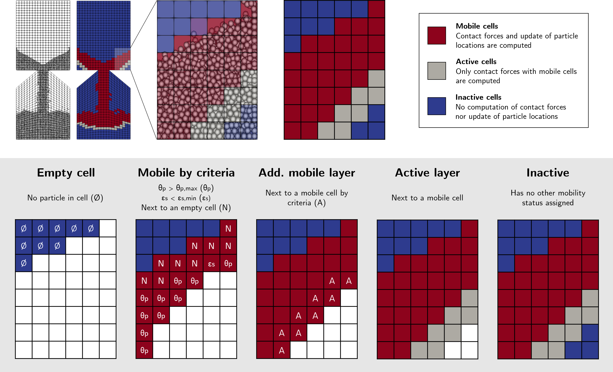

================
Model Parameters
================

In this subsection, contact detection, force models, time integration, load balancing and adaptive sparse contacts parameters are defined.

.. code-block:: text

  subsection model parameters
    subsection contact detection
      # Contact detection method
      # Choices are constant|dynamic
      set contact detection method                = dynamic

      # Particle-particle contact neighborhood size
      set neighborhood threshold                  = 1.3

      set dynamic contact search size coefficient = 0.8
      set frequency                               = 1
    end

    subsection load balancing
      # Choices are none|once|frequent|dynamic|dynamic_with_sparse_contacts
      set load balance method     = none
      set particle weight         = 2000   # Every method, except none
      set step                    = 100000 # if method = once
      set frequency               = 100000 # if method = frequent
      set dynamic check frequency = 10000  # if method = dynamic
      set threshold               = 0.5    # if method = dynamic

      subsection cell weight function
        set Function expression = 1000
      end
    end

      # Particle-particle contact force model
      # Choices are linear|hertz_mindlin_limit_overlap|hertz_mindlin_limit_force|hertz|hertz_JKR|DMT
      set particle particle contact force method = hertz_mindlin_limit_overlap

    # Particle-wall contact force model
    # Choices are linear|nonlinear|JKR|DMT
    set particle wall contact force method = nonlinear

    # DMT cut-off threshold
    set DMT cut-off threshold = 0.1

    # Integration method
    # Choices are euler|velocity_verlet
    set integration method                     = velocity_verlet

    # Rolling resistance method
    # Choices are no_resistance|constant_resistance|viscous_resistance|epsd_resistance
    set rolling resistance torque method       = constant_resistance
    set f coefficient                          = 0.0 # if rolling resistance torque method = epsd_resistance

    subsection adaptive sparse contacts
      set enable adaptive sparse contacts = false
      set enable particle advection       = false
      set granular temperature threshold  = 1e-4
      set solid fraction threshold        = 0.4
    end

    # Solver type
    # Choices are dem|cfd_dem
    set solver type = dem
  end

--------------------
Contact Detection
--------------------

Particle-particle contact search is a costly operation in DEM simulations. Contact detection parameters must be optimized to ensure a fast and physically accurate DEM simulation.

-  ``neighborhood threshold``  defines the spherical region around each particle which is used to generate the contact list. This parameter should generally be set between 1.3 and 1.5. It must be larger than 1 for contacts to be adequately taken into account.

Lethe defines two contact detection methods: ``dynamic`` and ``constant``

``contact detection method = dynamic``
~~~~~~~~~~~~~~~~~~~~~~~~~~~~~~~~~~~~~~~

Lethe rebuilds the contact lists automatically. In this mode, Lethe stores the displacements of each particle in the simulation since the last contact detection. If the maximum displacement of a particle exceeds the smallest contact search criterion, then the iteration is a contact search iteration and the contact list is rebuilt. The smallest contact search criterion is the minimum of the smallest cell size in the triangulation or the radius of the spherical region in fine search, and it is defined as:
 
.. math::
  \phi=\min({d_c^{min}-r_p^{max},\epsilon(\alpha-1)r_p^{max}})

where :math:`{\phi}`, :math:`{d_c^{min}}`, :math:`{r_p^{max}}`, :math:`{\epsilon}`, and :math:`{\alpha}` denote smallest contact search criterion, minimum cell size (in the triangulation), maximum particle radius (in polydisperse simulations), ``dynamic contact search size coefficient``, and ``neighborhood threshold``.

* ``dynamic contact search size coefficient`` is a safety factor to ensure the late detection of particles will not happen in the simulations with ``dynamic`` contact search; and its value should be defined generally in the range of 0.5-1. 0.5 is a rather conservative value. The default value of 0.8 is adequate for most simulations.
* ``frequency`` controls the frequency at which the dynamic contact search is carried out. For most cases, the default value of 1 should be maintained to ensure that the dynamic contact detection is refreshed accurately. Increasing this value between 2 and 5 can decrease the computational cost when a large (>16) number of cores is used since this diminishes the number of MPI communications.

``contact detection method = constant``
~~~~~~~~~~~~~~~~~~~~~~~~~~~~~~~~~~~~~~~
Contact search will be carried out at constant frequency. For most case (99%), ``dynamic`` contact detection should be used instead of ``constant``.

* ``frequency`` is the frequency at which the contact list is renewed. It should be a value between 5 and 50 iterations. Small values of ``frequency`` lead to long simulation times, while large values of ``frequency`` may lead to late detection of collisions. Late detection of collisions can result in very large particles velocities (popcorn jump of particles in a simulation) or particles leaving the simulation domain.

-------------------------------
Contact and Integration Methods
-------------------------------

All contact force models are described in the :doc:`../../theory/multiphase/cfd_dem/dem` section of the theory guide.

* ``integration`` controls the integration method  used. Lethe supports ``euler`` (1st order) and ``velocity-verlet`` (2nd order) time-integrators. The velocity-verlet should be used at all times. 

* ``particle particle contact force method`` controls the particle-particle contact force model. The following models are available in Lethe: ``hertz_mindlin_limit_overlap``, ``hertz_mindlin_limit_force``, ``hertz``, ``hertz_JKR``, ``DMT`` and ``linear``.
  
* ``particle wall contact force method`` controls the particle-wall contact force model used. The following models are available: ``linear``, ``nonlinear``, ``JKR`` and ``DMT``.

* ``dmt cut-off threshold`` controls the distance at witch the non contact forces are being negleted for the DMT cohesive force model.

.. note::
    The ``neighborhood threshold`` has to be large enough to correctly consider all non contact forces.

* ``rolling resistance method`` controls the rolling resistance model used. Three rolling resistance models are available: ``no_resistance``, ``constant_resistance``, ``viscous_resistance`` and ``epsd_resistance``

* ``f coefficient`` is a model parameter used for the ``epsd_resistance`` model which controls the proportion of the viscous damping applied when full mobilization is reached.

-----------------------
Load Balancing
-----------------------

Load-balancing updates the distribution of the subdomains between the processes in parallel simulation to achieve better computational performance (less simulation time). Three load-balancing methods are available in Lethe: ``once``, ``frequent``, or ``dynamic``. 

The total weight of each cell with particles in load-balancing is defined as:

.. math::
    W=W_pn_p + W_c

where :math:`{W_p}` is the ``particle weight``, :math:`{n_p}` is the number of particles in the cell and :math:`{W_c}` the cell of a the cell. The subsection ``cell weight function`` defines the weight every cell according to the position of their barycenter. By default, 1000 is the default weight assigned to one cell.

* ``particle weight`` must be defined for every ``load balance method``.

``load balance method = once``
~~~~~~~~~~~~~~~~~~~~~~~~~~~~~~
Load balancing will be done only once.

* ``step`` the iteration number at which the load balancing will be carried out.

``load balance method = frequent``
~~~~~~~~~~~~~~~~~~~~~~~~~~~~~~~~~~~
Load balancing will be done at a given frequency

* ``frequency`` frequency (in iterations) of the load balancing.

``load balance method = dynamic``
~~~~~~~~~~~~~~~~~~~~~~~~~~~~~~~~~
Load balancing will be done when the computational load amongst core is too uneven. If 

.. math::
    L_{max}-L_{min}>{\beta}\bar{L}

load balancing will be executed. :math:`{L}` and :math:`{\beta}` denote computational load on a process and ``threshold``, respectively.

* ``dynamic check frequency`` frequency (in iterations) at which the load check on all processes is performed.
* ``threshold`` is the maximal load unbalance tolerated by the load balancing.

------------------------------
Adaptive Sparse Contacts (ASC)
------------------------------

The ASC controls the disabling contact mechanism for performance enhancement. This feature adaptively searches for cells with low particle motion (granular temperature), disabling the computation of contacts for particles within these cells.
See how the mechanism works with mobility status in the figure below:

    The 5 steps of the mobility status identification of cells applied to a hopper case.

* ``enable adaptive sparse contacts`` enables the feature.

* ``enable particle advection`` enabled the advection of particles from an average source term derived from the average velocity of particles in cell. This is highly recommended for CFD-DEM simulations because of the hydrodynamic forces.
* ``granular temperature threshold`` is the threshold of the granular temperature below which the contacts are disabled.
* ``solid fraction threshold`` is the minimum solid fraction of the cell in which the contacts may be disabled.

Some parameters in the load balance section may be used to improve the performance of the dynamic disabling contacts feature using the dynamic load balancing.
.. note::
The ``load balance method`` may be set to ``dynamic_with_sparse_contacts`` and factors of the weight of the cells by mobility status may be adjusted using the ``active weight factor`` and ``inactive weight factor`` parameters. There is factor only for active and inactive status, mobile factor is always 1.

-----------
Solver Type
-----------
The "solver type" parameter controls the type of physic being solved by lethe. Currently, this parameter should always be set to "dem", which is the default value, even when solving a CFD-DEM problem.