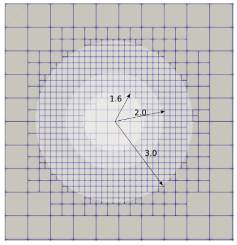

***********************************************
Resolved CFD-DEM
***********************************************

This subsection contains the parameters related to the resolved CFD-DEM around particles using a **sharp interface immersed boundary** (IB) **method**. This part of the parameter file concerns the usage of ``gls_sharp_navier_stokes_2d`` or ``gls_sharp_navier_stokes_3d``. These solvers can also be used to simulate the flow around static particles. In that case, using this solver eliminates the need to define a conformal mesh for the fluid between the particles.

.. code-block:: text

	subsection particles
		set number of particles                     = 1
		set stencil order                           = 2
		set length ratio                            = 4
		set assemble Navier-Stokes inside particles = false
		set calculate force                         = true
		set ib force output file                    = ib_force
		set ib particles pvd file                   = ib_particles_data
		set initial refinement                      = 0
		set refine mesh inside radius factor        = 0.5
		set refine mesh outside radius factor       = 1.5
		set integrate motion                        = false
		set particle nonlinear tolerance            = 1e-6
		set DEM coupling frequency                  = 1000
		set alpha                                   = 1
		set contact search radius factor            = 3
		set contact search frequency				= 1
		
		subsection gravity
			set Function expression =0;0;0
		end
		
		set wall friction coefficient               = 0
		set wall poisson ratio                      = 0.3
		set wall restitution coefficient            = 1
		set wall rolling friction coefficient       = 0
		set wall youngs modulus                     = 100000000
		set enable lubrication force		    = true
		set lubrication range max		    = 2
		set lubrication range min		    = 0.1
		
		subsection particle info 0
			set density    = 1
			subsection position
				set Function expression =0;0;0
			end
			subsection velocity
				set Function expression =0;0;0
			end
		    	subsection omega
		    		set Function expression =0;0;0
		    	end
		    	set inertia    = 1
		    	set pressure x = 0
		    	set pressure y = 0
		    	set pressure z = 0
		    	set radius     = 0.2
		    	set friction coefficient         = 0
		    	set poisson ratio                = 0.3
		    	set restitution coefficient      = 1
		    	set rolling friction coefficient = 0
		    	set youngs modulus               = 100000000
		end
	end
	
* The ``number of particles`` is the number of particles simulated by the sharp-edge IB.

* The ``stencil order`` parameter controls the order of the Lagrange polynomial used to impose the sharp interface immersed boundary condition. The order of the stencil should be higher than or equal to the order of interpolation of the underlying FEM scheme (e.g. for Q2Q2 elements use ``stencil order=2``). We suggest using the same order as the velocity field in most cases since it improves the condition number of the matrix.

.. note::
	The stencil order used does not alter the order of convergence of the solution.

* The ``length ratio`` parameter controls the length of the zone used to define the Lagrange polynomial (see `this article <https://www.sciencedirect.com/science/article/pii/S0045793022000780?via%3Dihub>`_ for more details). The length ratio should be kept as small as possible and above 1. When using a Cartesian homogenous mesh (aspect ratio of 1), the length ratio should be 1.

.. tip::
	A good starting value is twice the average aspect ratio of the elements in the mesh multiplied by the order of the underlying FEM scheme.

* The ``assemble Navier-Stokes inside particles`` parameter determines if the Navier-Stokes equations are solved inside the particles or not. If the Navier-Stokes equations are not solved (the parameter is false), the solver will solve a Poisson equation for each variable in the problem. This eliminates the need to define a reference value for the pressure. 

* The ``calculate force`` parameter controls if the force is evaluated on each particle. 

* The ``ib force output file`` parameter is the file name where the variables associated with each particle are stored. One file will be created for each particle in the simulation.

* The ``ib particles pvd file`` parameter is the file's name that will be created to animate the particles. This file stores all the variables calculated for each of the particles. This file is compatible with Paraview.

To sharpen the immersed boundary of each particles, a layer of cells around the immersed boundary can be refined forming a hypershell of refined cells.

* The ``refine mesh inside radius factor`` parameter defines the inside radius of the hypershell that forms the refinement zone around the particles. The radius used is the product between this factor and the particle's radius. For example: with a particle radius of 2 and the inside radius factor of 0.8, the inside radius of the refinement zone would be 1.6 (see example below).

* The ``refine mesh outside radius factor`` parameter defines the outside radius of the hypershell that forms the refinement zone around the particles. The radius used is the product between this factor and the particle's radius. For example: with a particle radius of 2 and the outside radius factor of 1.5, the outside radius of the refinement zone would be 3 (see example below). 

.. warning::
	When you want to use the hypershell refinement zone around particles, the mesh adaptation type used must be ``kelly``, otherwise no hypershell refinement will happen. See :doc:`../cfd/mesh_adaptation_control` for more details on adaptative mesh refinement.

.. note::
	The refined cells are all those for which at least one of the degrees of freedom (dof) location satisfies both the ``refine mesh inside radius factor`` and the ``refine mesh outside radius factor`` thresholds. Each application of the refinement zone reduces the size of the elements by a factor two.

.. note::
	This hypershell zone will systematically be refined at each refinement step until reaching the ``max refinement level`` parameter in :doc:`../cfd/mesh_adaptation_control`.

* The ``initial refinement`` parameter controls the number of refinement cycles in the hypershell refinement zone around every particle before the simulation starts. 

* The ``integrate motion`` parameter controls if the dynamics equations of the particles are calculated. If this parameter is set to false, the particles remain static.  If ``ìntegrate motion=true`` the position and the velocity will be defined by the particles' position and velocity function.

* The ``DEM coupling frequency`` parameter controls the number of iterations done on the DEM side for each CFD time step. It's necessary to use a much smaller time step for the particle dynamics than for the fluid in case of contact between the particles. The particle collision happens at a much smaller time-scale than the fluid dynamics.

* The ``particle nonlinear tolerance`` parameter controls particle dynamics' nonlinear tolerance. The nonlinear solver won't have converged until the residual on the dynamics equations of all the particles is smaller than this threshold.

* The ``alpha`` parameter is the relaxation parameter used when solving the dynamics equation of the particle.

* The ``contact search radius factor`` parameter is used to create the list of potential contacting particles. Two given particles with respective radii :math:`R_1` and :math:`R_2` are in potential contact if the distance between them is < :math:`(R_1 + R_2) * factor`. The default value of this parameter is set to 3.

.. note::
	If all particles may be taken into account in the contact search, a large value of ``contact search radius factor`` should be set.

.. warning::
	If ``contact search radius factor`` :math:`\leq 1`, an error is thrown.

* The ``contact search frequency`` parameter is used to set the updating frequency of the contact search list. By default, it is set to 1, that is, the contact search list is updated at each time-step.

* The subsection ``gravity`` defines the value of the gravity used in the simulation. This gravity can be defined as a function that evolves in time and space. Each component of the ``Function expression`` corresponds respectively to its magnitude in X, Y, and Z.

The following properties are used if the particle impact one of the boundaries of the domain. The effective properties used for calculating the impact force are calculated using a harmonic mean of the properties of the wall and the particle.

* The ``wall friction coefficient`` parameter is the coefficient of friction of the wall. This parameter is used to define the effective coefficient of friction between the wall and the particles. At this point in time, all the walls have the same properties.

* The ``wall poisson ratio`` parameter is the Poisson's ratio of the wall's material. This parameter is used to define the nonlinear spring constant used when a particle impacts a wall. At this point in time, all the walls have the same properties.

* The ``wall restitution coefficient`` parameter is the restitution coefficient of the wall's material. This parameter is used to define the effective restitution coefficient for the impact of a particle and the wall. At this point in time, all the walls have the same properties.

* The ``wall rolling friction coefficient`` parameter is the rolling friction coefficient of the wall. This parameter is used to define the effective rolling friction coefficient between the wall and the particles. At this point in time, all the walls have the same properties.

* The ``wall youngs modulus`` parameter is the Young's modulus of the wall's material. This parameter is used to define the nonlinear spring constant used when a particle impacts a wall. At this point in time, all the walls have the same properties.

* The ``enable lubrication force`` parameter enables or disables the use of lubrication forces. This parameter must be set to ``false`` when using non-newtonian fluid.

* The ``lubrication range max`` parameter defines the distance below which the lubrication force between 2 particles or between a particle and a wall is calculated. The range is defined as a multiple of the smallest cell. The lubrication force model is used to model the force between particles when they are too close to each other to accurately resolve the flow between them.

.. note::
	When using a non-Newtonian fluid, the lubrication force will be automatically deactivated.  

* The ``lubrication range min`` parameter defines the minimal distance used in the lubrication force calculation. The range is defined as a multiple of the smallest cell. This limits the force that can be applied on a particle since the lubrification force has a singularity when the distance between 2 particles is 0. We use this parameter to define a lower bound on the distance between 2 particles for the force calculation to avoid this singularity. Physically, this distance can be interpreted as the surface roughness of the particles.

.. note::
    The lubrication force between two particles is expressed by the equation :math:`\mathbf{F_{lub_{ij}}} = \frac{3}{2} \pi \mu_f \left(\frac{d_{p_i} d_{p_j}}{d_{p_i}+d_{p_j}}\right)^2 \frac{1}{y}(\mathbf{v_{ij}}\cdot \mathbf{e_{ij}})\mathbf{e_{ij}}`. Where :math:`\mu_f` is the fluid viscosity, :math:`d_{p_i}` the diameter of the first particle, :math:`d_{p_j}` the diameter of the second particle, :math:`y` the gap between the two particles, :math:`\mathbf{v_{ij}}` the relative velocity of the two particles, :math:`\mathbf{e_{ij}}` the unit vector along the line that joint the centroide of the two particles. In the case of particle wall lubrication force we take the diameter of the second particle to be infinity `[1] <https://doi.org/10.1002/aic.690400418>`_. 
    This model requires a constant viscosity and density of the fluid.

The following parameter and subsection are all inside the subsection ``particle info 0`` and have to be redefined for all particles separatly.

* The subsection ``particle info 0`` is used to define relevant information that is specific to the particle with id 0. For each particle with the index ``n``, a new subsection name ``particle info n`` should be defined with relevant information.

* The subsection ``position`` defines the initial value of the particle position if the parameter ``integrate motion=true``. Otherwise, it defines the particle's position at all points in time. This position is expressed as a function that can evolve in time. Each component of the ``Function expression`` corresponds to the value of coordinate X, Y, and Z. 

* The subsection ``velocity`` defines the initial value of the particle velocity if the parameter ``integrate motion=true``. Otherwise, it defines the particle's velocity at all points in time. This velocity is expressed as a function that can evolve in time. Each component of the ``Function expression`` corresponds to the value of its component in the X, Y, and Z direction.

* The subsection ``omega`` defines the initial value of the particle rotational velocity if the parameter ``integrate motion=true``. Otherwise, it defines the particle's rotational velocity at all times. This rotational velocity is expressed as a function that can evolve in time. Each component of the ``Function expression`` corresponds to the value of its component in the X, Y, and Z direction. It's important to note that even the 2D solver uses the rotational velocity in 3D. In that case, it will only use the Z component of the rotational velocity.

* The ``inertia`` parameter is used to define one of the diagonal elements of the rotational inertia matrix. Since we are defining spherical particles, we assume a uniform distribution of mass, and as such, all the diagonal elements of the rotational inertia matrix are the same.

* The ``pressure x``, ``pressure y``, and ``pressure z`` parameters are used to define the X, Y, and Z coordinate offset of the pressure reference point relative to the center of the particle. These parameters are used when the ``assemble Navier-Stokes inside particles`` parameter is set to true to define the pressure reference point.

* The ``radius`` parameter is used to define the radius of this particle.

The following properties are used if the particle impact one of the boundaries of the domain or another particle. The effective properties used to calculate the impact force are calculated using a harmonic mean of the properties of the particle and the object it impacts.

* The ``friction coefficient`` parameter is the coefficient of friction of the particle. This parameter is used to define the effective coefficient of friction between the wall and the particles.

* The ``poisson ratio`` parameter is the Poisson's ratio of the particle's material. This parameter is used to define the nonlinear spring constant used when a particle impacts a wall.

* The ``restitution coefficient`` parameter is the restitution coefficient of the particles' material. This parameter is used to define the effective restitution coefficient for the impact of a particle and the wall.

* The ``rolling friction coefficient`` parameter is the rolling friction coefficient of the particle. This parameter is used to define the effective rolling friction coefficient between the wall and the particles. The effective coefficient is calculated using a harmonic mean of the properties of the particles and the other objects it impacts.

* The ``youngs modulus`` parameter is the Young's modulus of the particle's material. This parameter is used to define the nonlinear spring constant used when a particle impacts a wall.

.. tip::
	For a particle to be accounted for in the fluid mesh, it has to overlap one or more vertices of this fluid mesh. If the initial mesh is too coarse in regards to the particle size, the particle may not be captured if it does not intersect the outer mesh walls. To avoid this, a box refinement can be added around the particle (See Box refinement documentation).

Mesh refinement
---------------------
The mesh is refined on multiple occasions during the simulations, and it can be slightly confusing to understand the sequence of refinement. There are 3 pre-simulation refinement steps. The one that occurs first is the **global mesh refinement**. It is set by the ``initial refinement`` parameter in the ``mesh`` subsection. 
The second refinement occuring is inside the **box refinement zone**, set by the ``initial refinement`` in the ``box refinement`` subsection. Lastly, the **particle hypershell zone** is refined, defined by the ``initial refinement`` parameter in the ``particles`` subsection.
Therefore, the hypershell zone around each particle is refined ``mesh``:``initial refinement`` + ``box``:``initial refinement`` + ``particle``:``initial refinement`` times before the simulations starts.

.. note::
	If the ``max refinement level`` parameter in the ``adaptation control`` subsection is smaller than the summation of all initial refinement parameters, no cell can be refined more than ``max refinement level``. Note that it does not mean that the refinement stops, meaning that there can be other cells that are refined to the ``max refinement level``, but no cell can be refined more than this. 

Reference
---------------
[1] Kim, Sangtae, and Seppo J. Karrila. Microhydrodynamics: principles and selected applications. Courier Corporation, 2013. `DOI <https://doi.org/10.1002/aic.690400418>`_.

