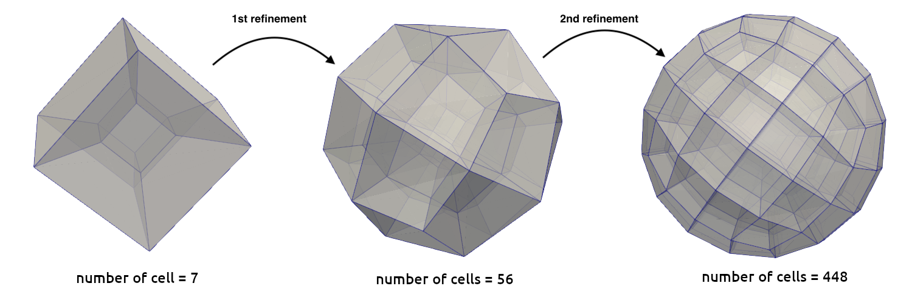

=============
Void Fraction
=============
In this subsection, all parameters required for the calculation of the void fraction are introduced.

.. code-block:: text

  subsection void fraction
    set mode                       = pcm
    set read dem                   = true
    set dem file name              = dem
    set l2 smoothing length        = 0
    set particle refinement factor = 0
  end

* The ``mode`` parameter allows the user to choose the method for void fraction calculation. Currently, there are two methods implemented. The first one is to calculate the void fraction from `function`. In this case, an additional subsection is required to insert the function such as:

.. code-block:: text

   # in the void fraction subsection
   subsection function
   set Function expression = 0.5 + 0.25*sin(pi*x)*sin(pi*y)
   end
     
If the ``mode`` chosen is ``pcm``, then the void fraction is calculated using the Particle Centered Method. If it is set to ``qcm``, then the void fraction is calculated using the Quadrature Centered Method. If it is set to ``spm``, then the void fraction is calculated using the satellite point method (divided approach). In these methods, the remaining parameters are required:

.. code-block:: text

  # in the void fraction subsection
  set qcm sphere diameter          = 0
  set qcm sphere equal cell volume = false
  set qcm filter type              = spherical
  set particle refinement factor   = 0
  set quadrature rule              = gauss
  set n quadrature points          = 0
  set project particle velocity    = false

* The ``read dem`` allows us to read an already existing dem simulation result which can be obtained from checkpointing the Lethe-DEM simulation. This is important as the `lethe-fluid-vans` solver requires reading an initial dem triangulation and particle information to simulate flows in the presence of particles. 
* The ``dem_file_name`` parameter specifies the prefix of the dem files that must be read.
* The ``l2 smoothing length`` is a smoothing length used for smoothing the L2 projection of the void fraction to avoid sharp discontinuities which can lead to instabilities in the simulation.
* The ``qcm sphere diameter`` allows us to fix the diameter of all reference spheres in the simulation to a given value. If this option is used (a value other than 0 is specified), it overrides the default calculation of the size of the sphere and sets its diameter to the value specified.
* The ``qcm sphere equal cell volume`` determines whether or not we want to use a reference sphere with the same volume as the element in which it is located. If it is disabled, then each sphere will have a radius equal to the size of the element in which it is located. This parameter is important only when the ``qcm sphere diameter`` is not used or is set to 0.
* The ``qcm filter type`` selects the kernel used to weigh particle contributions onto the mesh in the ``qcm`` method. Two options are available: ``spherical`` (default) and ``gaussian``. The user always sets ``qcm smoothing length`` to the **diameter** of the averaging sphere (spherical filter) or to **2σ** (Gaussian filter); the code halves this value internally to obtain the kernel characteristic length. For each particle of radius :math:`r_p` and volume :math:`V_p`, the kernel value at distance :math:`d` from the particle centre to a quadrature point is evaluated and then normalised by the sum of all kernel values over the neighbour-cell stencil so that the total particle volume is conserved.

  * **Spherical** (``spherical``): the kernel is the intersection volume between the particle sphere (radius :math:`r_p`) and an averaging sphere of radius :math:`\ell = \tfrac{1}{2}\,d_{\text{smooth}}` centred at the quadrature point. In 3-D, for an overlap distance :math:`0 < d < r_p + \ell`, this is

    .. math::

       K_{\text{sph}}(r_p,\ell,d) = \frac{\pi\,(r_p + \ell - d)^2
         \left(d^2 + 2d\,r_p - 3r_p^2 + 2d\,\ell + 6\,r_p\,\ell - 3\ell^2\right)}
         {12\,d}

    and zero when :math:`d \geq r_p + \ell`, or :math:`V_p` when :math:`d \leq \ell - r_p`.

  * **Gaussian** (``gaussian``): the kernel is the :math:`n`-dimensional isotropic Gaussian probability density scaled by the particle volume,

    .. math::

       K_{\text{gauss}}(r_p,\sigma,d) = V_p \cdot \frac{1}{(2\pi\sigma^2)^{n/2}}
         \exp\!\left(-\frac{d^2}{2\sigma^2}\right)

    where :math:`n` is the spatial dimension and :math:`\sigma = \tfrac{1}{2}\,d_{\text{smooth}}` is the standard deviation. The Gaussian has non-compact support: contributions outside the QCM neighbour-cell stencil are silently dropped, but the discrete renormalisation absorbs the missing mass to preserve conservation. :math:`\sigma` should be chosen small relative to the neighbour-cell stencil reach to avoid bias from the truncation.
* The ``quadrature rule`` is only required for the ``qcm``. The parameter allows us to choose the quadrature rule for the calculation of the void fraction. Such quadrature rule dictates the position of the quadrature points in the void fraction calculation. Currently, the implemented quadrature rules are Gauss (``gauss``) and Gauss-Lobatto (``gauss-lobatto``). The default behavior is ``set quadrature rule = gauss``.
* The ``n quadrature points`` is only required for the ``qcm``. The parameter allows us to specify the number of quadrature points to be used in the void fraction calculation. If the number of quadrature points is not specified or it is set to ``0``, the default value will be void_fraction_degree + 1 (in general 2) for the case of Gauss quadrature rule and void_fraction_degree+2 (in general 3) for the case of Gauss-Lobatto quadrature rule.
* The ``particle refinement factor`` is only required for the ``spm``. It allows to determine the number of pseudo-particles that we want to divide our particle into. By default, it is set to 0 refinements, and results in no refinement of the original meshed particle (division into 7 particles in 3D). Every additional refinement results in a :math:`2^{dim}` times more particles. The figure below shows how the number of pseudo-particles change with every refinement. Every cell in the particle mesh represents a pseudo-particle in the satellite point method.
* The ``project particle velocity`` allows to project the particle velocity field onto the fluid mesh. This is useful to visualize the particle velocity field in paraview. This option is only compatible with the ``qcm`` method since it relies on the same mechanisms.

