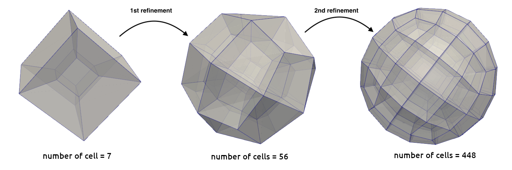

=============
Void Fraction
=============
In this subsection, all parameters required for the calculation of the void fraction are introduced.

.. code-block:: text

  subsection void fraction
    set mode                       = pcm
    set read dem                   = true
    set dem file name              = dem
    set l2 smoothing length        = 0
    set particle refinement factor = 0
  end

* The ``mode`` parameter allows the user to choose the method for void fraction calculation. Currently, there are two methods implemented. The first one is to calculate the void fraction from `function`. In this case, an additional subsection is required to insert the function such as:

.. code-block:: text

   # in the void fraction subsection
   subsection function
   set Function expression = 0.5 + 0.25*sin(pi*x)*sin(pi*y)
   end
     
If the ``mode`` chosen is ``pcm``, then the void fraction is calculated using the Particle Centered Method. If it is set to ``qcm``, then the void fraction is calculated using the Quadrature Centered Method. If it is set to ``spm``, then the void fraction is calculated using the satellite point method (divided approach). In these methods, the remaining parameters are required:

.. code-block:: text

  # in the void fraction subsection
  set qcm sphere diameter          = 0
  set qcm sphere equal cell volume = false
  set particle refinement factor   = 0

* The ``read dem`` allows us to read an already existing dem simulation result which can be obtained from checkpointing the Lethe-DEM simulation. This is important as the `lethe-fluid-vans` solver requires reading an initial dem triangulation and particle information to simulate flows in the presence of particles. 
* The ``dem_file_name`` parameter specifies the prefix of the dem files that must be read.
* The ``l2 smoothing length`` is a smoothing length used for smoothing the L2 projection of the void fraction to avoid sharp discontinuities which can lead to instabilities in the simulation.
* The ``qcm sphere diameter`` allows us to fix the diameter of all reference spheres in the simulation to a given value. If this option is used (a value other than 0 is specified), it overrides the default calculation of the size of the sphere and sets its diameter to the value specified.
* The ``qcm sphere equal cell volume`` determines whether or not we want to use a reference sphere with the same volume as the element in which it is located. If it is disabled, then each sphere will have a radius equal to the size of the element in which it is located. This parameter is important only when the ``qcm sphere diameter`` is not used or is set to 0.
* The ``particle refinement factor`` is only required for the ``spm``. It allows to determine the number of pseudo-particles that we want to divide our particle into. By default, it is set to 0 refinements, and results in no refinement of the original meshed particle (division into 7 particles in 3D). Every additional refinement results in a :math:`2^{dim}` times more particles. The figure below shows how the number of pseudo-particles change with every refinement. Every cell in the particle mesh represents a pseudo-particle in the satellite point method.

