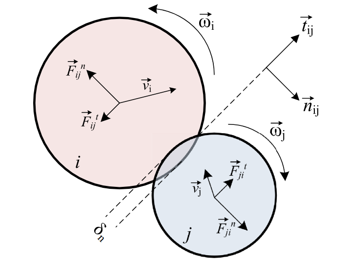

=============================
Discrete Element Method (DEM)
=============================

.. warning::
  *This page is under construction*

In this guide, we summarize the theory behind DEM. For further details, we refer the reader to the article by Golshan *et al.* `[1] <https://doi.org/10.1007/s40571-022-00478-6>`_

.. math::
    m_i\frac{d\mathbf{v_i}}{dt} &= \sum_{j\in \mathcal C_i} (\mathbf{F}_{ij}^n + \mathbf{F}_{ij}^t) + m_i\mathbf{g} + \mathbf{F}_i^\text{ext} \\
    I_i\frac{d\mathbf{\omega_i}}{dt} &= \sum_{j\in \mathcal C_i} (\mathbf{M}_{ij}^t + \mathbf{M}_{ij}^r) +  \mathbf{M}_i^\text{ext}

Where:

* :math:`m_i` mass of the particule i;
* :math:`\mathbf{v_i}` velocity of the particule i;
* :math:`\mathcal C_i` particles in contact list;
* :math:`\mathbf{F}_{ij}^n` normal contact force due to the contact between particles i and j;
* :math:`\mathbf{F}_{ij}^t` tangential contact force due to the contact between particles i and j;
* :math:`\mathbf{g}` gravitationnal acceleration;
* :math:`\mathbf{F}_i^\text{ext}` external forces;
* :math:`I_i` moment of inertia of particle i;
* :math:`\mathbf{\omega_i}` angular velocity of particle i;
* :math:`\mathbf{M}_{ij}^t` tangential friction torque due to the contact between particles i and j;
* :math:`\mathbf{M}_{ij}^r` rolling friction torque due to the contact between particles i and j;
* :math:`\mathbf{M}_i^\text{ext}` external torques;

--------------------------------
Contact Force and Torque Models
--------------------------------

The normal and tangential contact forces use linear or nonlinear viscoelastic models and are calculated as followed:

.. math::
    \mathbf{F}_{ij}^n &= -(k_n\delta_n)\mathbf{n}_{ij}-(\eta_n\mathbf{v}_{rn}) \\
    \mathbf{F}_{ij}^t &= -(k_t\mathbf{\delta}_t)-(\eta_t\mathbf{v}_{rt})

Where:

* :math:`\delta_n` normal overlap;
* :math:`\mathbf{\delta_t}` tangential overlap vector;
* :math:`\mathbf{n}_{ij}` contact normal vector;
* :math:`k_n, k_t` spring constants;
* :math:`\eta_n, \eta_t` damping model constants;
* :math:`\mathbf{v}_{rn}` relative velocity in the normal direction;
* :math:`\mathbf{v}_{tn}` relative velocity in the tangential direction;

    Representation of a typical particle-particle contact. [1]

The contact normal vector :math:`\mathbf{n}_{ij}` is computed as:

.. math::
    \mathbf{n}_{ij}=\frac{\mathbf{x}_{j}-\mathbf{x}_{i}}{\left|\mathbf{x}_{j}-\mathbf{x}_{i}\right|}

The normal overlap (:math:`\delta_n`) is the contact distance between the particles i and j. In the case of a collision between a particle and a wall, the wall is considered as j. The tangential overlap (:math:`\delta_t`) depends on the contact history and is updated during a contact.
The normal and tangential overlaps are calculated as follow:

.. math::
    \delta_n =& \:R_i + R_j - |\mathbf{x}_{j} - \mathbf{x}_{i}| \\
    \mathbf{\delta}_{ij}^{t,\text{new}} &= \mathbf{\delta}_{ij}^{t,\text{old}}+\mathbf{v}_{rt}dt

The relative velocities calculated to allow updating the tangential overlap are described by:

.. math::
    \mathbf{v}_{rn} &= \left(\mathbf{v}_{ij}.\mathbf{n}_{ij}\right)\mathbf{n}_{ij} \\
    \mathbf{v}_{rt} &= \mathbf{v}_{ij}-\mathbf{v}_{rn} \\
    \mathbf{v}_{ij} &= \mathbf{v}_i-\mathbf{v}_j+\left(R_i\mathbf{\omega}_i+R_j\mathbf{\omega}_j\right)\times\mathbf{n}_{ij}

.. list-table:: Spring and Damping Models used in Lethe-DEM.
   :widths: 40 30 30
   :header-rows: 1

   * - Parameters
     - Linear model definitions
     - Nonlinear viscoelastic model definitions
   * - Normal spring constant
     - :math:`k_n = \frac{16}{15}\sqrt{R_{e}}Y_{e}\left(\frac{15m_{e}V^2}{16\sqrt{R_{e}}Y_{e}}\right)^{0.2}`
     - :math:`k_n = \frac{4}{3}Y_{e}\sqrt{R_{e}\delta_n}`
   * - Normal damping model constant
     - :math:`\eta_n = -2\beta\sqrt{m_{e} k_n}`
     - :math:`\eta_n = -2\sqrt{\frac{5}{6}}\beta\sqrt{S_nm_{e}}`
   * - Tangential spring constant
     - :math:`k_t = 0.4 k_n`
     - :math:`k_t = 8G_{e}\sqrt{R_{e}\delta_n}`
   * - Tangential damping model constant
     - :math:`\eta_t = -2\beta\sqrt{m_{e} k_t}`
     - :math:`\eta_t = -2\sqrt{\frac{5}{6}}\beta\sqrt{S_tm_{e}}`

Where:

* :math:`R_e` effective radius;
* :math:`Y_e` effective Young's modulus;
* :math:`m_e` effective mass;
* :math:`V` characteristic impact velocity, this parameters is set to 1.0;
* :math:`e` coefficient of restitution;
* :math:`G_e` effective shear modulus;

The parameters are computed as followed:

.. math::
    \frac{1}{m_{e}} &= \frac{1}{m_i}+\frac{1}{m_j} \\
    \frac{1}{R_{e}} &= \frac{1}{R_i}+\frac{1}{R_j} \\
    \frac{1}{G_{e}} &= \frac{2(2-\nu_i)(1+\nu_i)}{Y_i}+\frac{2(2-\nu_j)(1+\nu_j)}{Y_j} \\
    \frac{1}{Y_{e}} &= \frac{\left(1-\nu_i^2\right)}{Y_i}+\frac{\left(1-\nu_j^2\right)}{Y_j} \\
    \beta &= \frac{\ln{e}}{\sqrt{\ln^2{e}+\pi^2}} \\
    S_n &= 2Y_{e}\sqrt{R_{e}\delta_n} \\
    S_t &= 8G_{e}\sqrt{R_{e}\delta_n}

Where:

* :math:`\nu_i, \nu_j` poisson coefficient of particle i or j;

Rolling friction may be calculated through a constant torque model or a viscous torque model corresponding to those equations:

.. math::
    \mathbf{M}_{ij}^{r} &= -\mu_{r}R_{e}|\mathbf{F}_{ij}^{n}| \mathbf{\hat{\omega}}_{ij} \\
    \mathbf{M}_{ij}^{r} &= -\mu_{r}R_{e}|\mathbf{F}_{ij}^{n}||\mathbf{V}_{\omega}| \mathbf{\hat{\omega}}_{ij}

Where the parameters are:

.. math::
    \mathbf{\hat{\omega}}_{ij} &= \frac{\omega_{i} - \omega_{j}}{|\omega_{i} - \omega_{j}|} \\
    \mathbf{V}_{\omega} &= \left( \omega_{i} \times R_{i}\mathbf{n}_{ij}-\omega_{j} \times R_{j}\mathbf{n}_{ji} \right)

Where:

* :math:`\mu_{r}` rolling friction coefficient;

Tangential torque is calculated through:

.. math::
    \mathbf{M}_{ij}^{t} = R_{i}\mathbf{n}_{ij} \times \mathbf{F}_{ij}^{c}

Coulomb's criterion is violated when this condition is not respected during a collision:

.. math::
    |\mathbf{F}_{ij}^{t}| \geq \mu |\mathbf{F}_{ij}^{n}|

A violation means the collision is having gross sliding and tangential force needs to be limited to the Coulomb limit.
To do so, the tangential overlap :math:`\mathbf{\delta_t}` is first limited and then the tangential force is recalculated.

The tangential overlap is calculated with the tangential force with no damping force as default nonlinear contact model as follow:

.. math::
    \mathbf{\delta_t} &= \frac{\mathbf{\tilde{F}_{ij}}}{-k_{t}} \\
    \mathbf{\tilde{F}_{ij}} &= \mathbf{\hat{F}_{ij}} + \eta_{t}\mathbf{v}_{rt} \\
    \mathbf{\hat{F}_{ij}^{t}} &= \mu |\mathbf{F}_{ij}^{n}| \frac{\mathbf{F}_{ij}^{t}}{|\mathbf{F}_{ij}^{t}|}

Regarding the particle-wall contacts, applied models are the same than particle-particle contacts with a background triangulation and mapping with walls.

---------------------------------------------
Johnson-Kendall-Roberts force model
---------------------------------------------
The Johnson-Kendall-Roberts (JKR) force models attractive forces due to van der Waals effects. `[3] <https://doi.org/10.3390/pr11010005>`_
This model modifies the Hertz formulation by defining a larger contact path radius (:math:`\mathbf{a}`) and taking into account the effective surface energy (:math:`\mathbf{\gamma}_{e}`).
The model is defined by:

.. math::
    a^{3} = \frac{3 R_{e}}{4 E_{e}} \left[F_{n}^{JKR} + 3\pi\gamma_{e}R_{e}  + \sqrt{6 F_{n}^{JKR} \pi\gamma_{e}R_{e} + (3\pi\gamma_{e}R_{e})^2 }\right]

Where :math:`\mathbf{F_{n}^{JKR}}` corresponds to the normal spring force and attractive force combined and :math:`\mathbf{\gamma_{e}}` is the effective surface energy.
Note that if the effective surface energy is equal to zero, the JKR model reverts to Hertz model.

The effective surface energy can be computed as:

.. math::
    \gamma_{e} = \gamma_{1} + \gamma_{2} - 2\gamma_{1,2}

Where :math:`\gamma_{1}` and :math:`\gamma_{2}` are the surface energy of each material (particle or wall) :math:`\gamma_{1,2}` is the interface energy which is equal to zero when both surfaces are coming from the same material.
In Lethe, the interface energy term is approximated using `[4] <https://doi.org/10.1016/B978-0-12-391927-4.10013-1>`_:

.. math::
    \gamma_{1,2} \approx \left( \sqrt{\gamma_{1}} - \sqrt{\gamma_{2}}  \right)^{2}

To compute the :math:`\mathbf{F_{n}^{JKR}}`, the contact patch radius needs to be determined. The contact patch radius can be related to the normal overlap as follows:

.. math::
    \delta_{n} = \frac{ a^{2} }{ R_{e} } -  \sqrt{ \frac{2 \pi \gamma_{e} a }{ Y_{e} } }

This equation can be rewritten as a fourth-order polynomial function with two complex and two real roots.

.. math::
    0 = a^{4} - 2R_{e}\delta_{n}a^{2} - 2\pi\gamma_{e}R_{e}^{2}a + R_{e}^{2}\delta_{n}^{2}

Since we are always solving for the same real root, a straightforward procedure, described by Parteli et al. can be used `[5] <https://doi.org/10.1038/srep06227>`_:

.. math::
    c_{0} &= R_{e}^{2}\delta_{n}^{2} \\
    c_{1} &= -2\pi\gamma_{e}R_{e}^{2}\\
    c_{2} &= -2R_{e}\delta_{n}\\
    P &= -\frac{c_{2}^{2}}{12} - c_{0} \\
    Q &= - \frac{c_{2}^{3}}{108} + \frac{c_{0}c_{2}}{3} - \frac{c_{1}^{2}}{8} \\
    U &= \left[ -\frac{ Q }{ 2 } + \sqrt{  \frac{ Q^{2} } {4} + \frac{ P^{3} }{ 27 }  }  \right]^{ \frac{1}{3} } \\
    s &=
    \begin{cases}
    -5c_2/6 + U - \frac{P}{3U} &{if}\: P \neq 0 \\
    -5c_2/6 + Q^{\frac{1}{3}}  &{if}\: P = 0
    \end{cases}\\
    \omega &= \sqrt{c_{2} + 2 s} \\
    \lambda &= \frac{c_{1} }{2 \omega}\\
    a &= \frac{1}{2}\left(\omega + \sqrt{\omega^{2} - 4(c_{2} + s + \lambda ) } \right)

Finally, the :math:`\mathbf{F_{n}^{JKR}}` can be computed as follows:

.. math::
    F_{n}^{JKR} = \frac{4 Y_{e} a^{3}}{3 R_{e}} - \sqrt{8 \pi \gamma_{e} Y_{e} a^{3} }

The normal damping, tangential damping and tangential spring constants need to be computed using the same procedure as the nonlinear model.

For implementation reasons, a simplified version of the JKR model (SJKR-A) is implemented in Lethe. This version does not calculate non-contact forces. Please refer to C. J. Coetzee and O. C. Scheffler for more information on the different versions of the JKR model and their specific features. `[3] <https://doi.org/10.3390/pr11010005>`_

--------------------
Integration Methods
--------------------

Two types of integration methods are implemented in Lethe-DEM:

* Explicit Euler method;
* Velocity Verlet method

Explicit Euler method is calculated as:

.. math::
    \mathbf{v}_{i}^{n+1} &= \mathbf{v}_{i}^{n} + \mathbf{a}_{i}^{n}dt \\
    \mathbf{x}_{i}^{n+1} &= \mathbf{x}_{i}^{n} + \mathbf{v}_{i}^{n}dt

And velocity Verlet method is calculated with half-step velocity as:

.. math::
    \mathbf{v}_{i}^{n+\frac{1}{2}} &= \mathbf{v}_{i}^{n} + \mathbf{a}_{i}^{n}\frac{dt}{2} \\
    \mathbf{x}_{i}^{n+1} &= \mathbf{x}_{i}^{n} + \mathbf{v}_{i}^{n+\frac{1}{2}}dt \\
    \mathbf{v}_{i}^{n+1} &= \mathbf{v}_{i}^{n+\frac{1}{2}} + \mathbf{a}_{i}^{n+1}\frac{dt}{2}

-------------
References
-------------

`[1] <https://doi.org/10.1007/s40571-022-00478-6>`_ S. Golshan, P. Munch, R. Gassmöller, M. Kronbichler, and B. Blais, “Lethe-DEM: an open-source parallel discrete element solver with load balancing,” *Comput. Part. Mech.*, vol. 10, no. 1, pp. 77–96, Feb. 2023, doi: 10.1007/s40571-022-00478-6.

`[2] <https://mfix.netl.doe.gov/doc/mfix-archive/mfix_current_documentation/dem_doc_2012-1.pdf>`_ R. Garg, J. Galvin-Carney, T. Li, and S. Pannala, “Documentation of open-source MFIX–DEM software for gas-solids flows,” Tingwen Li Dr., p. 10, Sep. 2012.

`[3] <https://doi.org/10.3390/pr11010005>`_ C. J. Coetzee and O. C. Scheffler, “Review: The Calibration of DEM Parameters for the Bulk Modelling of Cohesive Materials,” Processes, vol. 11, no. 1, Art. no. 1, Jan. 2023, doi: 10.3390/pr11010005.

`[4] <https://doi.org/10.1016/B978-0-12-391927-4.10013-1>`_ J. N. Israelachvili, “Chapter 13 - Van der Waals Forces between Particles and Surfaces,” in Intermolecular and Surface Forces (Third Edition), Third Edition., J. N. Israelachvili, Ed., Boston: Academic Press, 2011, pp. 253–289. doi: https://doi.org/10.1016/B978-0-12-391927-4.10013-1.

`[5] <https://doi.org/10.1038/srep06227>`_ E. J. R. Parteli, J. Schmidt, C. Blümel, K.-E. Wirth, W. Peukert, and T. Pöschel, “Attractive particle interaction forces and packing density of fine glass powders,” Sci Rep, vol. 4, no. 1, Art. no. 1, Sep. 2014, doi: 10.1038/srep06227.
