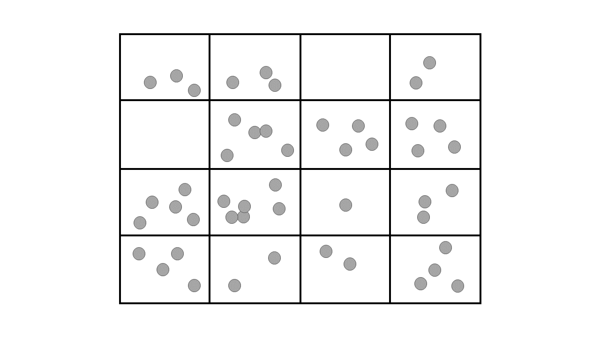
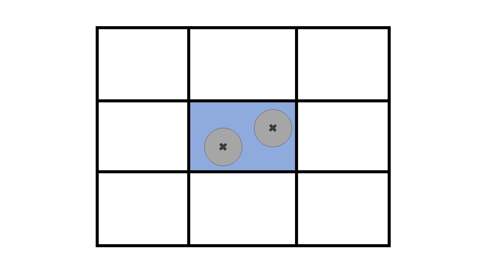
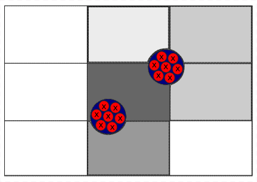
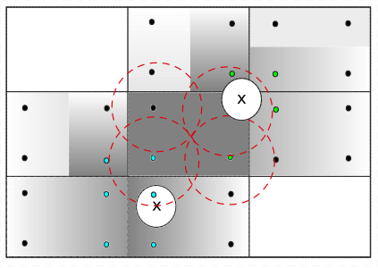

===========================
Unresolved CFD-DEM 
===========================

Unresolved CFD-DEM is a technique with high potential for designing and analyzing multiphase flows involving particles and fluid. Some examples of these systems are fluidized beds, stirred-tanks, and flocculation processes. In this approach, we apply Newton's second law of motion to each particle individually such that their movement is described at a micro-scale (as in DEM simulations). On the other hand, the fluid is represented at a meso-scale by a mesh of cells, to which we apply the Volume Average Navier-Stokes (VANS) equations.

The micro-meso scale approach allows for particle-fluid simulations involving large numbers of particles with reasonable computational cost and highly detailed results (in both time and space). As a counterpart, the interchanged momentum between phases needs to be modeled, i.e., it is not obtained straightforwardly from the application of a no-slip boundary condition at the interface between the fluid and the particles. The following image represents the micro-meso scale approach applied in unresolved CFD-DEM simulations, where the rectangles represent mesh of the geometry and the gray spots represent the particles.

In this guide, we summarize the theory behind Unresolved CFD-DEM. For further details, we refer the reader to the articles by Bérard *et al.* [#berard2020]_, and Zhou *et al.* [#zhou2010]_.

Particles
----------

Applying Newton's second law on the particle :math:`i` surrounded by fluid a :math:`f`, we find:

.. math::
    m_i \frac{\mathrm{d}\mathbf{v}_i}{\mathrm{d}t} = \sum_{j}\mathbf{f}_{c,ij} + \sum_{j}\mathbf{f}_{nc,ij} + \mathbf{f}_{fp,i} + \mathbf{f}_{g,i} \\
    I_i \frac{\mathrm{d}\mathbf{\omega}_i}{\mathrm{d}t} = \sum_{j}\left ( \mathbf{M}_{c,ij} + \mathbf{M}_{r,ij} \right ) + \sum_{w}\left ( \mathbf{M}_{c,iw} + \mathbf{M}_{r,iw} \right )

where:

* :math:`m_i` is the mass of the particle :math:`i`;
* :math:`\mathbf{v}_i` is the velocity of the particle :math:`i`;
* :math:`\mathbf{f}_{c,ij}` are the contact forces between particles :math:`i` and :math:`j` (detailed in the DEM section of this guide);
* :math:`\mathbf{f}_{nc,ij}` are the non-contact forces between particles :math:`i` and :math:`j`, such as lubrication forces [#nitsche1994]_;
* :math:`\mathbf{f}_{fp,i}` is the force exerted by the surrounding fluid over particle :math:`i`. Here, the subscript :math:`fp` indicates the force exerted by the fluid on the particles;
* :math:`\mathbf{f}_{g,i}` is the gravitational force;
* :math:`I_i` is the moment of inertia;
* :math:`\mathbf{\omega}_i` is the angular velocity;
* :math:`\mathbf{M}_{c,ij}` is the torque between particles :math:`i` and :math:`j`;
* :math:`\mathbf{M}_{r,ij}` is the rolling friction between particles :math:`i` and :math:`j`;
* :math:`\mathbf{M}_{c,iw}` is the torque between particle :math:`i` and walls :math:`w`;
* :math:`\mathbf{M}_{c,iw}` is the rolling friction between particle :math:`i` and walls :math:`w`;

Apart from :math:`\mathbf{f}_{fp,i}`, all the other terms of the previous equations are detailed in the DEM section of this theory guide (see :doc:`../dem/dem`). The momentum transport between phases :math:`\mathbf{f}_{fp,i}` can be written as:

.. math::
    \mathbf{f}_{fp,i} = \mathbf{f}_{\nabla p,i} + \mathbf{f}_{\nabla \cdot \mathbf{\tau},i} + \mathbf{f}_{d,i} + \mathbf{f}_{Ar,i} + \mathbf{f}_{g,i} + \mathbf{f}''_{i}

where:

* :math:`\mathbf{f}_{\nabla p,i}` is the force due to the pressure gradient;
* :math:`\mathbf{f}_{\nabla \cdot \tau,i}` is the force due to the shear stress;
* :math:`\mathbf{f}_{d,i}` is the drag force;
* :math:`\mathbf{f}_{Ar,i}` is the buoyancy (Archimedes) force;
* :math:`\mathbf{f}_{g,i}` is the force due to gravity;
* :math:`\mathbf{f}''_{i}` are the remaining forces, including virtual mass, Basset, Lift, and Magnus (currently not implemented in Lethe).

.. note::
    Since the pressure in Lethe does not account for the hydrostatic pressure, i.e., the gravity term is not taken into account in the Navier-Stokes equations (see :doc:`../../multiphysics/fluid_dynamics/navier-stokes`), we explicitly insert :math:`\mathbf{f}_{Ar,i}` in :math:`\mathbf{f}_{pf,i}`.  

In unresolved CFD-DEM, the drag force is calculated using correlations (frequently called drag models). The drag models implemented in Lethe are described in the `unresolved CFD-DEM parameters guide <../../../parameters/unresolved-cfd-dem/cfd-dem>`_.

Volume-Averaged Navier-Stokes
------------------------------

Since we represent the fluid at a meso-scale, the quantities calculated for the cells are filtered. Additionally, variations in time and space of the volume occupied by the fluid are accounted for by the void fraction (or porosity). The resulting equations are the Volumed-Averaged Navier-Stokes (VANS) equations, which are solved to obtain the velocity and the pressure of the continuous fluid phase. In Lethe, the VANS equations are presented in two different formulations, so-called Model A (or Set II) and Model B (or Set I) `[2] <https://doi.org/10.1017/S002211201000306X>`_.

Considering an incompressible flow, the continuity equation for both models is:

.. math::
    \frac{\partial \varepsilon_f}{\partial t} + \nabla \cdot \left ( \varepsilon_f \mathbf{u} \right ) = 0

where:

* :math:`\mathbf{u}` is the filtered fluid velocity vector;
* :math:`\varepsilon_f` is the void fraction.

Models A and B differ from each other in the way the momentum equation is calculated:

Model A:

.. math:: 
    \rho_f \left ( \frac{\partial \left ( \varepsilon_f \mathbf{u} \right )}{\partial t} + \nabla \cdot \left ( \varepsilon_f \mathbf{u} \otimes \mathbf{u} \right ) \right ) = -\varepsilon \nabla p + \varepsilon \nabla \cdot \tau +  \bar{\mathbf{F}}_\mathrm{A}^{\mathrm{pf}}

Model B:

.. math:: 
    \rho_f \left ( \frac{\partial \left ( \varepsilon_f \mathbf{u} \right )}{\partial t} + \nabla \cdot \left ( \varepsilon_f \mathbf{u} \otimes \mathbf{u} \right ) \right ) = -\nabla p + \nabla \cdot \tau +  \bar{\mathbf{F}}_\mathrm{B}^{\mathrm{pf}}

where:

* :math:`\rho_f` is the density of the fluid;
* :math:`p` is the pressure;
* :math:`\tau` is the deviatoric stress tensor;
* :math:`\bar{\mathbf{F}}_\mathrm{A}^{\mathrm{pf}}` and :math:`\bar{\mathbf{F}}_\mathrm{B}^{\mathrm{pf}}` are the source terms representing the volumetric forces on the fluid due to the interaction with particles for Models A and B, respectively. We note them as capital letter to emphasize that they are forces per unit volume and not forces. These volumetric interaction forces (:math:`\mathbf{F}_{pf}^A` and :math:`\mathbf{F}_{pf}^B`) are obtained by regularizing the particle-fluid interaction forces using a kernel function :math:`k_r` :

.. math::
    \bar{\mathbf{F}}_\mathrm{A}^{\mathrm{pf}} &= \sum_{i} k_r \left (\lVert \mathbf{x} - \mathbf{x}_i \rVert \right ) \left (\mathbf{f}_i^{\mathrm{pf}} - \mathbf{f}_i^{\nabla p} - \mathbf{f}_i^{\nabla \cdot \mathbf{\tau}} \right ) \\
    \bar{\mathbf{F}}_\mathrm{B}^{\mathrm{pf}} &= \sum_{i} k_r \left (\lVert \mathbf{x} - \mathbf{x}_i \rVert \right ) \mathbf{f}_i^{\mathrm{pf}}

with :math:`k_r` normalized such that

.. math::
    \int_{\Omega} k_r \left (\lVert \mathbf{x} \rVert \right ) \mathrm{d}\mathbf{x} = 1

When the Particle-in-Cell method is used for the particle-fluid coupling, the regularization is carried out over the cells of the mesh by averaging the quantity over the cells. However, this is not ideal since it leads to a definition of the force that depends on the mesh. To remediate this issue, Lethe also supports filtering the solid-fluid forces using a spherical top-hat filter through the Quadrature-Centered method (QCM). This results in a filter definition that is independent of the mesh and that depends only on the top-hat filter radius.

Lethe is capable of simulating unresolved CFD-DEM cases with both Models A and B (see the :doc:`../../../parameters/unresolved-cfd-dem/cfd-dem` page of this guide).

Void Fraction
--------------
Determining the void fraction is an important step in unresolved CFD-DEM, as can be noted by the VANS equations and the drag models [#rong2013]_. There exist several methods for the calculation of the void fraction in a CFD-DEM simulation. Some are approximations while others are analytical approaches. In the finite element method, the void fraction is initially calculated inside a cell but must then be projected to the mesh nodes so that one can assemble the system of equations. This is done by :math:`\mathcal{L}^2` projection [#larson2013]_:

.. math:: 
    \min_{\varepsilon_{f,j} \in \mathbb{R}} \frac{1}{2} \sum_i \left (\sum_j \varepsilon_{f,j} \varphi_j - \epsilon_{f} \right )^2 \varphi_i

where :math:`\epsilon_{f}` is the void fraction, :math:`\varphi_j` is the finite element shape function of the void fraction, and :math:`\varepsilon_{f,j}` the nodal values of the projected void fraction. Then, we assemble and solve the following:

.. math::
    \int_{\Omega} \varepsilon_{f,j} \varphi_i  \varphi_j d \Omega = \int_{\Omega}  \epsilon_{f} \varphi_i d \Omega

Lethe also has the option of smoothing the void fraction profile, which helps to mitigate sharp discontinuities. This is specifically advantageous when using void fraction schemes that are discontinuous in space and time such as the PCM and SPM. To do so, we add to the left hand side of the previous equation a term similar to a Poisson equation. This acts as an additional parabolic filter. The resulting equation is:

.. math::
    \int_{\Omega} \varepsilon_{f,j} \varphi_i  \varphi_j d \Omega +  \iint_\Omega L^2 \varepsilon_{f,j} \nabla \varphi_i \nabla \varphi_j d\Omega = \int_{\Omega} \epsilon_{f} \varphi_i d \Omega

   

where :math:`L` is the smoothing length, used as parameter in Lethe unresolved CFD-DEM simulations. In Lethe, three void fraction schemes are currently supported to calculate :math:`\epsilon_{f}`. They are the particle centroid method, the satellite point method, and the quadrature centered method.

The Particle Centroid Method
~~~~~~~~~~~~~~~~~~~~~~~~~~~~
The Particle Centroid Method (PCM) [#peng2014]_ is simple and it is a commonly used method. It consists of tracking the position of the centroid of each particle and applying the total volume of the particle to the calculation of the void fraction of the cell. This means that in either of the following situations the void fraction of the colored cell is the same:

.. image:: images/void_frac2.png
   :width: 49%

This results in the PCM being discontinuous in space and time. Consequently, the PCM method significantly relies on the smoothing of the void fraction to lead to a sufficiently smooth void fraction field. We refer the reader to [#geitani2023]_  for an extensive discussion on this topic. 

 The void fraction in a cell using PCM can be written as:

.. math:: 
    \epsilon_f = 1 - \frac{\sum_{i}^{n_p} V_{p,i}}{V_\Omega}

where :math:`n_p` is the number of particles whose centroids lie inside the cell :math:`\Omega` of volume :math:`V_{\Omega}`. 

The Satellite Point Method
~~~~~~~~~~~~~~~~~~~~~~~~~~
This method divides each particle into pseudo-particles where the sum of the volume of all pseudo-particles in a single particle is equal to the volume of the particle. Then, each pseudo-particle is treated similarly to the PCM, that is, the centroid of each pseudo-particle is tracked, and the entire volume of the pseudo-particle is considered in a given cell if its centroid lies within. 

   
The void fraction in a cell using SPM can be written as: 

.. math:: 
       \epsilon_f = 1 - \frac{\sum_{i}^{n_p}\sum_{i}^{n_{sp}} V_{sp,j}}{V_\Omega}

where :math:`n_{sp}` is the number of pseudo-particles j belonging to particle i with centroid inside the cell :math:`\Omega` with volume :math:`V_{\Omega}` and :math:`V_{sp}` is the volume of the satellite point. The satellite point method suffers from the same limitations as the PCM. However, it is slightly less discontinuous due to the refined nature of the particles.

The Quadrature Centered Method
~~~~~~~~~~~~~~~~~~~~~~~~~~~~~~
The Quadrature Centered Method (QCM) [#geitani2023]_  is an analytical method that decouples the averaging volume from the mesh cells. It constructs an averaging sphere centered at each quadrature point in a given cell, and it calculates the void fraction directly in the averaging volume at the quadrature point. Since the sphere-sphere (particle-averaging sphere) intersection is analytically easier to calculate than sphere-polyhedron (particle-mesh cell), this method is less expensive than other analytical methods as the intersection does not involve the calculation of trigonometric functions at each CFD time step. The advantage of this method is that the void fraction varies within a cell. Additionally, particles in neighboring cells can affect the void fraction of the current cell. This allows the method to be continuous in both space and time. This is advantageous, especially in solid-liquid systems where the term :math:`\rho_f \frac{\partial \epsilon_f}{\partial t}` of the continuity equation is very stiff and unstable, when there exist even small discontinuities in the void fraction, and where it explodes when :math:`\Delta t_{CFD} \to 0`.

An averaging volume sphere is constructed around each quadrature point. All particles lying in the sphere will contribute to the void fraction value of this quadrature point. Therefore, a cell will be affected by the particles lying in it and in its neighboring cells.

The void fraction at the quadrature point using QCM can be written as:

.. math:: 
      \epsilon_f  = 1 - \frac{\sum_{i}^{n_p} V^N_{p,i}}{V^N_{sphere}}
    
where :math:`V^N_{sphere}` is the normalized volume of the volume averaging spheres and :math:`V^N_{p,i}` is the normalized volume of the particle. In order not to miss any particle in the current cell and to avoid exceeding neighboring cells, the volume of the averaging spheres is defined through the user specified sphere radius (:math:`R_s`) and should respect the following condition:

.. math:: 
    \frac{h_{\Omega}}{2} \leq R_s \leq h_{\Omega}
    

References
-----------
.. [#berard2020] \A. Bérard, G. S. Patience, and B. Blais, “Experimental methods in chemical engineering: Unresolved CFD-DEM,” *Can. J. Chem. Eng.*, vol. 98, no. 2, pp. 424–440, 2020, doi: `10.1002/cjce.23686 <https://doi.org/10.1002/cjce.23686>`_\.

.. [#zhou2010] \Z. Y. Zhou, S. B. Kuang, K. W. Chu, and A. B. Yu, “Discrete particle simulation of particle–fluid flow: model formulations and their applicability,” *J. Fluid Mech.*, vol. 661, pp. 482–510, Oct. 2010, doi: `10.1017/S002211201000306X <https://doi.org/10.1017/S002211201000306X>`_\.

.. [#nitsche1994] \L. C. Nitsche, “Microhydrodynamics: Principles and selected applications. By Sangtae Kim and Seppo J. Karrila, Butterworth-Heinemann, Boston, 1991” *AIChE J.*, vol. 40, no. 4, pp. 739–743, 1994, doi: `10.1002/aic.690400418 <https://doi.org/10.1002/aic.690400418>`_\.

.. [#rong2013] \L. W. Rong, K. J. Dong, and A. B. Yu, “Lattice-Boltzmann simulation of fluid flow through packed beds of uniform spheres: Effect of porosity,” *Chem. Eng. Sci.*, vol. 99, pp. 44–58, Aug. 2013, doi: `10.1016/j.ces.2013.05.036 <http://dx.doi.org/10.1016/j.ces.2013.05.036>`_\.

.. [#peng2014] \Z. Peng, E. Doroodchi, C. Luo, and B. Moghtaderi, “Influence of void fraction calculation on fidelity of CFD-DEM simulation of gas-solid bubbling fluidized beds,” *AIChE J.*, vol. 60, no. 6, pp. 2000–2018, 2014, doi: `10.1002/aic.14421 <https://doi.org/10.1002/aic.14421>`_\.

.. [#larson2013] \M. G. Larson and F. Bengzon, *The Finite Element Method: Theory, Implementation, and Applications*. Springer Science & Business Media, 2013. https://link.springer.com/book/10.1007/978-3-642-33287-6\.

.. [#geitani2023] \T. El Geitani and B. Blais, “Quadrature-Centered Averaging Scheme for Accurate and Continuous Void Fraction Calculation in Computational Fluid Dynamics–Discrete Element Method Simulations,” *Ind. Eng. Chem. Res.*, vol. 62, no. 12, pp. 5394–5407, Mar. 2023, doi: `10.1021/acs.iecr.3c00172 <https://doi.org/10.1021/acs.iecr.3c00172>`_\.
