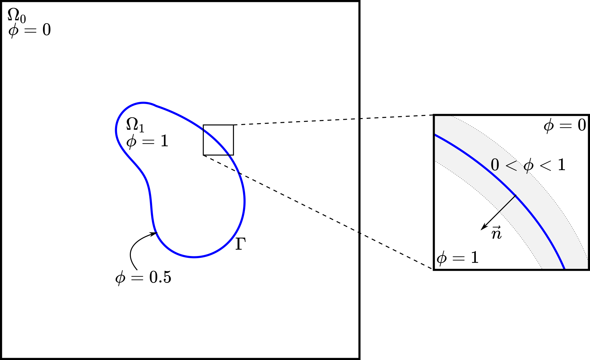

================================
The Volume of Fluid (VOF) Method
================================

Numerous examples of flow encountered in engineering involve multiple fluids: sloshing of fuel in aircraft tanks, mixing of bread dough, and motion of droplets and bubbles to name a few. In these cases, the involved fluids can be immiscible, and we are interested in the evolution of the interfaces between those fluids.

Let :math:`\Omega = \Omega_0 \cup \Omega_1` be the domain formed by two fluids, namely fluid :math:`0` and :math:`1`, with :math:`\Gamma` denoting their interface and :math:`\partial \Omega`, the remaining boundaries, as illustrated in the figure below. In the VOF method `[1] <https://doi.org/10.1016/0021-9991(81)90145-5>`_, we define the scalar function :math:`\phi` as a phase indicator such that:

.. math::
  \phi =
  \begin{cases}
    0 \quad \forall \vec{x} \in \Omega_0\\
    1 \quad \forall \vec{x} \in \Omega_1
  \end{cases}

This phase indicator (or phase fraction) changes rapidly but smoothly from :math:`0` to :math:`1` at the interface such that :math:`\Gamma` is located at the iso-contour :math:`\phi=0.5`, as illustrated below.

The evolution of :math:`\Gamma` (or the iso-contour :math:`\phi=0.5`) in the time interval :math:`[0,T]` due to the action of velocity field :math:`\vec{u}` on :math:`\Omega` is described by the advection equation of the field :math:`\phi`:

.. math::
  \frac{\partial \phi}{\partial t} + \nabla \cdot \left( \vec{u} \phi \right) = 0 \quad \forall (\vec{x},t)\in \Omega\times[0,T]

or using `Einstein notation <https://en.wikipedia.org/wiki/Einstein_notation>`_:

.. math::
  \partial_t \phi + \partial_i \phi u_i = 0 \quad \forall (x_i,t)\in \Omega\times[0,T]

Developing the second term gives:

.. math::
  \partial_t \phi + \phi\partial_i u_i + u_i\partial_i\phi = 0 \quad \forall (x_i,t)\in \Omega\times[0,T]

Typically, the term :math:`\phi\partial_i u_i` (or :math:`\phi \nabla \cdot \vec{u}`) is zero due to mass conservation in the Navier-Stokes equations. However, previous work done in Lethe showed that while :math:`\nabla \cdot \vec{u}=0` is globally respected, it is not locally respected, especially around the interface, so lets keep it for now.

To complete the strong formulation of the problem, let's impose a no flux boundary condition on :math:`\partial \Omega`:

.. math::
  \partial_i \phi n_i= 0 \quad \forall (x_i,t)\in \partial \Omega\times[0,T]

where :math:`n_i` represent the outward pointing unit normal vector of :math:`\partial \Omega`, i.e., :math:`\vec{n}`.

Finite Element Formulation
---------------------------

To obtain the finite element formulation, we first need the weak formulation. Therefore, let :math:`v` be an arbitrary scalar function on :math:`\Omega`. To obtain the weak form, we multiply the strong problem by :math:`v` and integrate over :math:`\Omega`:

.. math::
  \int_\Omega v \left( \partial_t \phi + \phi\partial_i u_i + u_i\partial_i\phi\right) d \Omega = 0

To ensure that those integrals are well defined in :math:`\Omega`, we chose the appropriate solution spaces:

.. math::
  \phi \in \Phi(\Omega) = H^1(\Omega)

.. math::
  v \in V(\Omega) = L^2(\Omega)

Thus, the weak problem is:

Find :math:`\phi \in \Phi(\Omega) \times [0,T]` such that

.. math::
  \int_\Omega v \left( \partial_t \phi + \phi\partial_i u_i + u_i\partial_i\phi\right) d \Omega = 0 \quad \forall v\in V

Using Petrov-Galerkin method, the finite element formulation reads:

Find :math:`\phi^h \in \Phi^h \times [0,T]` such that

.. math::
  \int_\Omega v^h \left( \partial_t \phi^h + \phi^h\partial_i u_i + u_i\partial_i\phi^h\right) d \Omega = 0 \quad \forall v^h\in V^h\times [0,T]

where :math:`\Phi^h` and :math:`V^h` are finite element spaces, and :math:`\phi^h(\vec{x},t) = \sum_{j=1}^N \phi_j(t)\psi_j(\vec{x})`. In standard notation, this formulation corresponds to:

Find :math:`\phi^h \in \Phi^h \times [0,T]` such that

.. math::
  \int_\Omega v^h \left(\frac{\partial \phi^h}{\partial t} + \phi^h \nabla \cdot \vec{u} + \vec{u}\cdot \nabla \phi^h \right) d \Omega = 0 \quad \forall v^h\in V^h\times [0,T]

Stabilization
--------------

The numerical resolution of the advection equation requires stabilization because of its purely advective character, which makes the equation hyperbolic. Furthermore, a second stabilization term is added to improve the capturing of the interface due to sharp gradient across :math:`\Gamma`. Since SUPG only adds diffusion along the streamlines, crosswind oscillations may occur if no appropriate shock capturing scheme is used. To that end, a Discontinuity-Capturing Directional Dissipation (DCDD) shock capturing scheme is used `[2] <https://doi.org/10.1002/fld.505>`_:

.. math::

  &\int_\Omega v^h \left( \partial_t \phi^h + \phi^h\partial_i u_i + u_i\partial_i\phi^h\right) d \Omega \\
  &\quad + \sum_k \int_{\Omega_k}\tau_\mathrm{SUPG} u_i\partial_i v^h\left(\partial_t \phi^h + \phi^h\partial_i u_i + u_i\partial_i\phi^h \right) d \Omega_k \\
  &\qquad + \sum_k \int_{\Omega_k}v_\mathrm{DCDD}f_\mathrm{DCDD} \partial_i v^h \partial_i \phi^h  d \Omega_k  = 0

where the first element wise summation represents the SUPG stabilization term and the second is the shock capturing scheme. The same SUPG stabilization as in the Navier-Stokes finite element formulation is used (see :doc:`../fluid_dynamics/stabilization`). The terms of the DCDD scheme are:

.. math::

  &v_\mathrm{DCDD} = \frac{1}{2} h^2 \|\vec{u}\| \| \nabla \phi^h \| \\
  &f_\mathrm{DCDD} = \frac{\nabla \phi^h}{\| \nabla \phi^h \|} \frac{\nabla \phi^h}{\| \nabla \phi^h \|}

The term :math:`v_\mathrm{DCDD}` ensures that diffusivity is added only where there is a large phase gradient and a non-zero velocity, i.e., where the interface :math:`\Gamma` is in motion. The term :math:`f_\mathrm{DCDD}` is intended to add diffusivity only in the crosswind direction, since streamline diffusion is already added by the SUPG stabilization. However, for now, diffusivity is added in every direction where there is a phase gradient.

The DCDD scheme leads to a non-linear finite element formulation. Thus, the latter is resolved with the Newton-Raphson method.

Interface Diffusion and Sharpening
-----------------------------------

The VOF method tends to diffuse the interface, i.e., over time, the interface becomes blurry instead of a sharp definition, and the change from :math:`\phi = 0` to :math:`1` happens on a larger distance.

Thus, we use sharpening methods to keep the change in :math:`\phi` sharp at the interface. Two methods are currently available: interface sharpening and interface filtration.

""""""""""""""""""""""""""""""""
Interface Sharpening
""""""""""""""""""""""""""""""""

The current interface sharpening method consists of two steps:

1. Phase fraction limiter

.. math::

    \phi = \min \left( \max \left(\phi^{old},0 \right),1 \right)

The phase fraction limiter above will update the phase fraction if it failed to respect these bounds.

2. Interface sharpening

.. math::

    \phi =
    \begin{cases}
    c^{1-\alpha} \phi^{\alpha} &  (0 \leq \phi < c  ) \\
    1-(1-c)^{1-\alpha}(1-\phi)^{\alpha} & (c \leq \phi \leq 1  )
    \end{cases}

where :math:`c` denotes the sharpening threshold, which defines
a phase fraction threshold (generally :math:`0.5`), and :math:`\alpha` corresponds to the interface sharpness, which is a model parameter generally in the range of :math:`(1,2]`. This interface sharpening method was proposed by Aliabadi and Tezduyar (2000) `[3] <https://doi.org/10.1016/S0045-7825(00)00200-0>`_.

""""""""""""""""""""""""""""""""
Interface Filtration
""""""""""""""""""""""""""""""""

In the interface filtration method, the following filter function is applied to the phase fraction :math:`\phi` in order to get a better definition of the interface between the fluids:

.. math::
    \phi' = 0.5 \tanh[\beta(\phi-0.5)] + 0.5

where :math:`\phi'` is the filtered phase fraction value, and :math:`\beta` is a model parameter that enables sharper definition when increased. Recommended value is :math:`\beta=20`.

Surface Tension
---------------

When two immiscible fluids are in contact, surface tension tends to deform their interface (also called the free surface) into a shape that ensures a minimal energy state. An example would be the force that drives a droplet into its spherical shape `[4] <https://doi.org/10.1016/0021-9991(92)90240-Y>`_.

Resolution of the interface motion via the advection equation allows to compute the surface tension term and add its effect to the Navier-Stokes momentum equations.

As its name suggests, the surface tension :math:`\bf{f_{\sigma}}` is a surface force. It is applied at the interface between two immiscible fluids and is given by:

.. math::

    {\bf{f_{\sigma}}} = \sigma \kappa {\bf{n}}

where :math:`\sigma` is the surface tension coefficient, :math:`\kappa` is the curvature and :math:`\bf{n}` is the unit normal vector of the free surface. Here, :math:`{\bf{f_{\sigma}}}` is a force per unit of area. To account for its effect in the Navier-Stokes equations, the surface force is transformed in a volumetric surface force :math:`\bf{F_{\sigma}}` using the continuous surface force (CSF) model `[4] <https://doi.org/10.1016/0021-9991(92)90240-Y>`_, that is:

.. math::

    {\bf{F_{\sigma}}} = \bf{f_{\sigma}} \delta = \sigma \kappa {\bf{n}}\delta

where :math:`\delta` is a Dirac delta measure with support on the interface. A good approximation for the term :math:`{\bf{n}}\delta` is :math:`{\bf{n}}\delta = \nabla \phi`, where :math:`\phi` is the phase fraction. Thus, the volumetric surface force is given by:

.. math::

    {\bf{F_{\sigma}}} =  \sigma \kappa \nabla \phi

where the curvature :math:`\kappa` is computed according to:

.. math::

    \kappa = - \nabla \cdot \bf{n}

and the unit normal vector of the free surface, pointing from fluid 0 to 1, is obtained with:

.. math::

    \bf{n} = \frac{\nabla \phi}{|\nabla \phi|}

When including the surface tension force in the resolution of the Navier-Stokes equations, the numerical computation of the curvature can give rise to parasitic flows near the interface between the two fluids. To avoid such spurious currents, the phase fraction gradient and curvature are filtered using projection steps `[5] <https://doi.org/10.1002/fld.2643>`_, as presented in section :ref:`Normal and curvature computations`.

.. _Normal and curvature computations:

"""""""""""""""""""""""""""""""""
Normal and Curvature Computations
"""""""""""""""""""""""""""""""""

The following equations are used to compute the filtered phase fraction gradient and filtered curvature. They correspond to the projection steps previously mentioned.

.. math::

    \int_\Omega \left( {\bf{v}} \cdot {\bf{\psi}} + \eta_n \nabla {\bf{v}} \cdot \nabla {\bf{\psi}} \right) d\Omega = \int_\Omega \left( {\bf{v}} \cdot \nabla {\phi} \right) d\Omega

where :math:`{\bf{v}}` is a vector test function, :math:`\bf{\psi}` is the filtered phase fraction gradient, :math:`\eta_n` is the phase fraction gradient filter value, and :math:`\phi` is the phase fraction.

.. math::

    \int_\Omega \left( v \kappa + \eta_\kappa \nabla v \cdot \nabla \kappa \right) d\Omega = \int_\Omega \left( \nabla v \cdot \frac{\bf{\psi}}{|\bf{\psi}|} \right) d\Omega

where :math:`\kappa` is the filtered curvature, and :math:`\eta_\kappa` is the curvature filter value, and :math:`v` is a test function.

The phase fraction gradient filter :math:`\eta_n` and the curvature filter value :math:`\eta_\kappa` are respectively computed according to:

.. math::

  \eta_n = \alpha h^2

  \eta_\kappa = \beta h^2

where :math:`\alpha` and :math:`\beta` are user-defined factors, and :math:`h` is the cell size. Recommended values are :math:`\alpha = 4.0` and :math:`\beta = 1.0`.

References
-----------

`[1] <https://doi.org/10.1016/0021-9991(81)90145-5>`_ C. W. Hirt and B. D. Nichols, “Volume of fluid (VOF) method for the dynamics of free boundaries,” *J. Comput. Phys.*, vol. 39, no. 1, pp. 201–225, Jan. 1981, doi: 10.1016/0021-9991(81)90145-5.

`[2] <https://doi.org/10.1002/fld.505>`_ T. E. Tezduyar, “Computation of moving boundaries and interfaces and stabilization parameters,” *Int. J. Numer. Methods Fluids*, vol. 43, no. 5, pp. 555–575, 2003, doi: 10.1002/fld.505.

`[3] <https://doi.org/10.1016/S0045-7825(00)00200-0>`_ S. Aliabadi and T. E. Tezduyar, “Stabilized-finite-element/interface-capturing technique for parallel computation of unsteady flows with interfaces,” *Comput. Methods Appl. Mech. Eng.*, vol. 190, no. 3, pp. 243–261, Oct. 2000, doi: 10.1016/S0045-7825(00)00200-0.

`[4] <https://doi.org/10.1016/0021-9991(92)90240-Y>`_	J. U. Brackbill, D. B. Kothe, and C. Zemach, “A continuum method for modeling surface tension,” *J. Comput. Phys.*, vol. 100, no. 2, pp. 335–354, Jun. 1992, doi: 10.1016/0021-9991(92)90240-Y.

`[5] <https://doi.org/10.1002/fld.2643>`_ S. Zahedi, M. Kronbichler, and G. Kreiss, “Spurious currents in finite element based level set methods for two-phase flow,” *Int. J. Numer. Methods Fluids*, vol. 69, no. 9, pp. 1433–1456, 2012, doi: 10.1002/fld.2643.