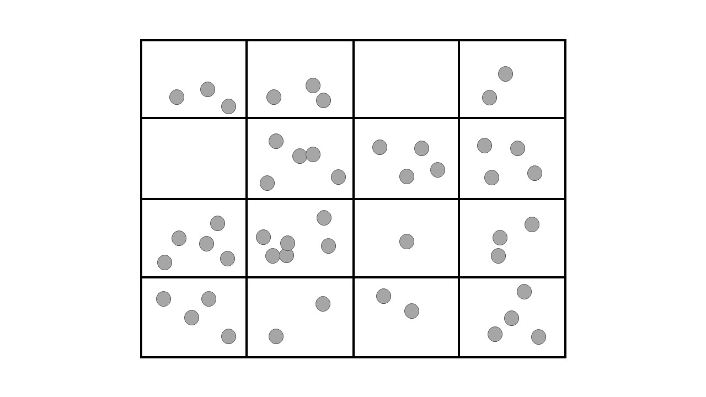

Unresolved CFD-DEM coupling
############################

Unresolved CFD-DEM coupling is a technique with high potential for design and analysis of multiphase flows involving particles and fluid, such as fluidized beds, stirred and floculation tanks. In this approach, we apply Newton's second law to each particle individually such that their movement is described at a micro scale (as in DEM simulations). For the fluid, the Volume Average Navier-Stokes (VANS) equations are used to describe the fluid at a meso scale. The meso-micro scale allows for particle-fluid simulations involving large numbers of particles with reasonable computational cost and highly detailed results (in both time and space). As a counterpart, the interchanged momentum between phases need to be modeled, i.e., not resolved. The following image represents the meso-micro scale approach applied in unresolved CFD-DEM simulations.

In this guide, we summarize the theory behind Unresolved CFD-DEM. For further details, we refer the reader to the articles by Bérard, Patience & Blais (2019) `[1] <https://doi.org/10.1002/cjce.23686>`_, and Zhou et al. (2010) `[2] <https://doi.org/10.1017/S002211201000306X>`_.

Applying Newton's second law on the particle :math:`i` surrounded by fluid a :math:`f`, we find:

.. math::
    m_i \frac{d \mathbf{v}_i}{dt} = \sum_{j}\mathbf{f}_{c,ij} + \sum_{j}\mathbf{f}_{nc,ij} + \mathbf{f}_{pf,i} + \mathbf{f}_{g,i} \\
    I_i \frac{d\mathbf{\omega}_i}{dt} = \sum_{j}\left ( \mathbf{M}_{c,ij} + \mathbf{M}_{r,ij} \right ) + \sum_{w}\left ( \mathbf{M}_{c,iw} + \mathbf{M}_{r,iw} \right )

where:

* :math:`m_i` is the mass of the particle;
* :math:`v_i` is the velocity vector;
* :math:`\mathbf{f}_{c,ij}` are the contact forces between particles :math:`i` and :math:`j` (detailed in the DEM section of this guide);
* :math:`\mathbf{f}_{nc,ij}` are the non-contact forces between particles :math:`i` and :math:`j`, such as lubrication `[3] <https://doi.org/10.1002/aic.690400418>`_.
* :math:`\mathbf{f}_{pf,i}` is the force exerted by the surrounding fluid over particle :math:`i`;
* :math:`\mathbf{f}_{g,i}` is the gravity force;
* :math:`I_i` is the momentum of inertia;
* :math:`\mathbf{\omega}_i` is the angular velocity;
* :math:`\mathbf{M}_{c,ij}` is the torque between particles :math:`i` and :math:`j`;
* :math:`\mathbf{M}_{r,ij}` is the rolling friction between particles :math:`i` and :math:`j`;
* :math:`\mathbf{M}_{c,iw}` is the torque between particle :math:`i` and walls :math:`w`;
* :math:`\mathbf{M}_{c,iw}` is the rolling friction between particle :math:`i` and walls :math:`w`;

Apart from :math:`\mathbf{f}_{pf,i}`, all the other terms of the previous equations are detailed in the DEM section of this theory guide (**under construction**). The momentum transport between phases :math:`\mathbf{f}_{pf,i}` can be written as:

.. math::
    \mathbf{f}_{pf,i} = \mathbf{f}_{\nabla p,i} + \mathbf{f}_{\nabla \cdot \mathbf{\tau},i} + \mathbf{f}_{d,i} + \mathbf{f}_{Ar,i} + \mathbf{f}_{g,i} + \mathbf{f}''_{i}

where:

* :math:`\mathbf{f}_{\nabla p,i}` is the force due to the pressure gradient;
* :math:`\mathbf{f}_{\nabla \cdot \tau,i}` is the force due to the shear stress;
* :math:`\mathbf{f}_{d,i}` is the drag force;
* :math:`\mathbf{f}_{Ar,i}` is the buoyant (Archimedes) force;
* :math:`\mathbf{f}_{g,i}` is the force due to gravity;
* :math:`\mathbf{f}''_{i}` are the remaining forces, including virtual mass, Basset, Lift, and Magnus (currently not implemented in Lethe).

Since pressure in Lethe does not account for the hydrostatic pressure, we explicitly insert :math:`\mathbf{f}_{Ar,i}` in :math:`\mathbf{f}_{pf,i}`.

In unresolved CFD-DEM drag is calculated using correlations (frequently called drag models). The drag models implemented in Lethe are described in the `unresolved CFD-DEM parameters guide <https://lethe-cfd.github.io/lethe/parameters/unresolved_cfd-dem/cfd_dem.html>`_.

Since we represent the fluid at a meso scale, the quantities calculated for the subdomain are actually averages among its volume. 

, we calculate all quantities in unresolved CFD-DEM based on the volume average inside the fluid subdomain. To do this, we apply the Volume Average Navier-Stokes (VANS) equations on the fluid phase: 

.. math::
    \nabla \cdot \mathbf{u} &= 0   \\
    \frac{\partial \mathbf{u}}{\partial t}  + \mathbf{u} \cdot \nabla \mathbf{u} &= -\frac{1}{\rho} \nabla p  + \nu \nabla^2 \mathbf{u} +\mathbf{f}

where:

* :math:`\mathbf{u}` is the velocity of the fluid. :math:`\mathbf{u}` is a vector such that :math:`\mathbf{u}=[u,v]^T` in 2D and :math:`\mathbf{u}=[u,v,w]^T` in 3D.

* :math:`p` is the pressure

* :math:`\nabla` is the `del operator <https://en.wikipedia.org/wiki/Del>`_

* :math:`\rho` is the density of the fluid.

* :math:`\nu` is the `kinematic viscosity <https://en.wikipedia.org/wiki/Viscosity>`_ of the fluid.

* :math:`\mathbf{f}` is a momentum source term.

Reference
---------------
`[1] <https://doi.org/10.1002/cjce.23686>`_ Bérard, Patience, and Blais. Experimental methods in chemical engineering: Unresolved CFD‐DEM. The Canadian Journal of Chemical Engineering, v. 98, n. 2, p. 424-440, 2020.

`[2] <https://doi.org/10.1017/S002211201000306X>`_ Zhou, Kuang, Chu, and Yu, Discrete particle simulation of particle–fluid flow: model formulations and their applicability, Journal of Fluid Mechanics, vol. 661, pp. 482–510, 2010.

`[3] <https://doi.org/10.1002/aic.690400418>`_ Kim, Sangtae, and Karrila. Microhydrodynamics: principles and selected applications. Courier Corporation, 2013.
