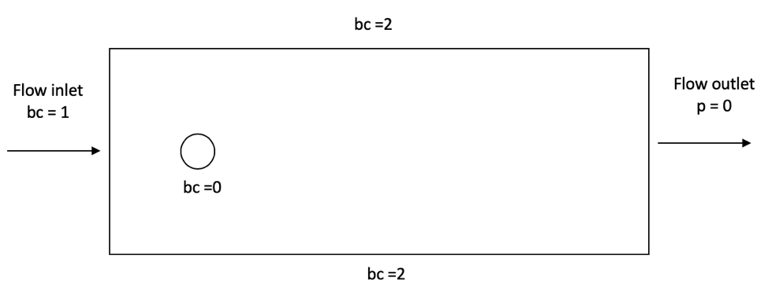

========================================================
How to Automatically Create and Launch Lethe Simulations
========================================================

.. seealso::
	All files used in this example are available in `lethe/contrib/utilities <https://github.com/lethe-cfd/lethe/tree/master/contrib/utilities>`_ under ``automatic_launch``.

The main Python scripts of this tutorial are:

- ``generate_cases_locally.py``
- ``generate_cases_cluster.py``
- ``launch_lethe_locally.py``
- ``launch_lethe_cluster.py``

.. seealso::
	The example :doc:`../../examples/incompressible-flow/3d-mixer-using-single-rotating-frame/3d-mixer-using-single-rotating-frame` uses really similar automatic launch scripts.

-------------------------------------
Generate Automatically Multiple Cases
-------------------------------------
Let us say that you are simulating a flow around a cylinder and you want to see how the inlet velocity impacts the force around the sphere.
Lazy as we are, we want to automatically generate multiple copies of the cylinder case, but change the parameter file such that the inlet velocity is different for each case.

You will need all these files from the :doc:`../../examples/incompressible-flow/2d-flow-around-cylinder/2d-flow-around-cylinder` example:

- ``cylinder.prm``
- ``cylinder-structured.geo``
- ``cylinder-structured.msh``

Here are the boundary conditions of the flow around the cylinder.

In the ``.prm`` file, we need to set ``bc = 1`` as ``Function expression`` , which represents the velocity :math:`u` in the :math:`x` direction.

To do so, we use the `Jinja2 <https://jinja.palletsprojects.com/en/3.1.x/>`_ Python package.
It allows us to create a parameter file template, where parameter variables in double brackets ``{{}}``, can be replaced by any value we want.

The boundary conditions section in the ``.prm`` file becomes as follow.

.. code-block:: text
    
    subsection boundary conditions
      set number = 3
      subsection bc 0
        set type = noslip
      end
      subsection bc 1
        set type = function
        subsection u
          set Function expression = {{velocity_x}}
        end
        subsection v
          set Function expression = 0
        end
        subsection w
          set Function expression = 0
        end
      end
      subsection bc 2
        set type = slip
      end
    end

.. note::
	Note the ``{{velocity_x}}`` parameter variable is in Jinja2 format.
	This will allow us to insert a specified value for the 2D around a cylinder case. 

We will now present how to generate multiple folders, containing different parameters files, to ultimately launch them as separate cases.
We can generate these folders locally and even on a Digital Alliance cluster.

.. note::
	See the documentation about :doc:`../../installation/digital_alliance`.

""""""""""""""""""""""""""""""""""
Locally
""""""""""""""""""""""""""""""""""
Before importing the packages, we need to install them using ``pip`` and ``requirements.txt`` (available in the lethe-utils folder).

.. code-block:: text
    
	pip install -r requirements.txt

Then, we can import the right packages to launch the script.

.. code-block:: python
    
	from jinja2 import Template
	import os
	import numpy as np
	import shutil

The first thing to do is set up the constants of the script.

.. code-block:: python
    
	PATH = os.getcwd()
	CASE_PREFIX = 'cylinder_u_'
	PRM_FILE = 'cylinder.prm'
	MESH_FILE = 'cylinder-structured.msh'

- ``PATH`` is the current path of the user directory where all cases' folders will be placed.
- ``CASE_PREFIX`` will specify how we want to name each folder.
- ``PRM_FILE`` is the name of the parameter file of the Lethe simulation.
- ``MESH_FILE`` is the name of the mesh used for the simulations.

.. warning::
	The ``.msh`` file is not available as it is. You will need to run ``gmsh`` in order to generate the mesh around the cylinder from the ``.geo`` file.
	See the documentation about ``gmsh`` here: :doc:`../gmsh/gmsh`.

Then we specify the range of velocity we want to explore.
In this example, we will generate 20 cases of the flow around a cylinder, where the inlet velocity varies from 1 to 10 :math:`m/s`.

.. code-block:: python
    
	number_of_cases = 20
	first_velocity = 1
	last_velocity = 10
	velocity = np.linspace(1, 10, number_of_cases)

Now, the fun begins.

First, we create a Jinja2 template.

.. code-block:: python

	templateLoader = jinja2.FileSystemLoader(searchpath=PATH)
	templateEnv = jinja2.Environment(loader=templateLoader)
	template = templateEnv.get_template(PRM_FILE)

For each velocity in the range specified above,

.. code-block:: python
    
	for u in velocity:

we will:

1. Render the template with the right value.

.. code-block:: python

	parameters = template.render(velocity_x=u)

.. warning::
	In the rendering step, it is really important to use the same variable name as the template file.

Then, we will need to copy in the ``case_path`` (the path of one case's folder) all the files we need for the simulation.

2. Name the ``case_path`` and create it.
   
.. code-block:: python

	case_folder_name = f'{CASE_PREFIX}{u:.2f}'
	case_path = f'{PATH}/{case_folder_name}'
	os.mkdir(case_path)

3. Copy the ``.prm`` file and the ``.msh`` file from the current ``PATH`` to the ``case_path``.

.. code-block:: python

	shutil.copy(f'{PATH}/{PRM_FILE}', f'{case_path}/{PRM_FILE}')
	shutil.copy(f'{PATH}/{MESH_FILE}', f'{case_path}/{MESH_FILE}')

4. Write the parameter file of the case with the rendered template.

.. code-block:: python

	with open(f'{case_path}/{PRM_FILE}', 'w') as f:
		f.write(parameters)

And voilà! The final current directory should look like this:

.. code-block:: text

	+---automatic_launch
	|   +---cylinder_u_1.00
	|   |       cylinder-structured.msh
	|   |       cylinder.prm
	|   |
	|   +---cylinder_u_1.95
	|   |       cylinder-structured.msh
	|   |       cylinder.prm
	|   |
	|   +---cylinder_u_2.42
	|   |       cylinder-structured.msh
	|   |       cylinder.prm
	|   |
	|   \---cylinder_u_10.00
	|   |       cylinder-structured.msh
	|   |       cylinder.prm

.. hint::
	Verify that the ``cylinder.prm`` files in each folder have a different boundary condition at ``bc = 1``. This means that the Jinja2 script worked perfectly fine.

""""""""""""""""""""""""""""""""""""""
On Digital Alliance of Canada clusters
""""""""""""""""""""""""""""""""""""""
If you want to generate different cases of a 2D flow around a cylinder, but on a cluster, the same script applies, with minor differences.

Before launching the script, we strongly suggest you to create a virtual environment. It is much easier to download the packages that you need.

1. Load the python module on the cluster.

.. code-block:: text

	module load python/3.X

2. Create the virtual environment.

.. code-block:: text

	virtualenv --no-download ENV

3. Activate the virtual environment.

.. code-block:: text

	source ENV/bin/activate

.. note::
	The tag ``(ENV)`` should appear before the command prompt, meaning that you are in your virtual environment.

4. Install the requirements of the script.

.. code-block:: text

	pip install -r requirements.txt

To leave the virtual environment, just deactivate it with the command ``deactivate``.

You can now launch the script on the cluster. Be sure to activate your virtual environment and change these lines of code that are specific to the cluster:

1. Specify the shell script that will launch a job on the cluster.

.. code-block:: python

	SHELL_FILE = 'launch_lethe.sh'

2. Copy the ``.sh`` from the current ``PATH`` to the ``case_path``.

.. code-block:: python

	shutil.copy(f'{PATH}/{SHELL_FILE}', f'{case_path}/{SHELL_FILE}')

This last step allows to launch one job script for each case.
The ``launch_lethe.sh`` is the job script that sends the simulation to the cluster scheduler.

If you have multiple cases to launch on the cluster (let's say 100 thousand), it is not a good idea to launch a really heavy Python script on the cluster.
If you do this, a crying baby panda will appear and hunt you.
To do so, it is recommended to create another job script that launches the automatic generator itself.

The automatic generator script is named ``launch_cases.py``. Here is an example of how to make the job script:

.. code-block:: text

	#!/bin/bash
	#SBATCH --time=02:00:00
	#SBATCH --account=$yourgroupaccount
	#SBATCH --ntasks=1
	#SBATCH --mem-per-cpu=32G
	#SBATCH --mail-type=FAIL
	#SBATCH --mail-user=$your.email.adress@email.provider
	#SBATCH --output=%x-%j.out

	source $SCRATCH/ENV/bin/activate
	srun python3 launch_cases.py

.. note::
	Note that we activate the virtual environment in order to have the packages required, and then we launch the Python script with ``srun``.

-----------------------------------
Launch Automatically Multiple Cases
-----------------------------------
Now that the folders of every case are all set up, we can launch Lethe automatically.

Both Python scripts to launch Lethe locally and on the cluster are simple and are presented below.

""""""""""""""""""""""""""""""""""
Locally
""""""""""""""""""""""""""""""""""
Launching locally will simulate one case at a time.

Here is the script:

1. Set up the constants of the script.

.. code-block:: python

	PATH = os.getcwd()
	PRM_FILE = 'cylinder.prm'
	LETHE_EXEC = 'lethe-fluid'

.. warning::
	Here, we suppose that the executable ``lethe-fluid`` is available directly in the ``PATH`` where all cases' folders are present.
	If your Lethe executable is elsewhere, just change the path to the right destination.

2. Enter each case's folder and execute Lethe.

.. code-block:: python

	for root, directories, files in os.walk(PATH):
		if PRM_FILE in files and root != PATH:
			os.chdir(root)
			os.system(f'{LETHE_EXEC} {PRM_FILE}')

.. note::
	If you want to run each simulation with more than one core, change the last line for ``os.system(f'mpirun -np $n {LETHE_EXEC} {PRM_FILE}')``, with ``n`` being the number of CPU cores.

""""""""""""""""""""""""""""""""""""""
On Digital Alliance of Canada clusters
""""""""""""""""""""""""""""""""""""""
The same script applies for launching all cases on a cluster. The advantage is that we send jobs to the scheduler, meaning that we can run multiple simulations at a time, instead of doing it one after the other.
The only difference is the command line to launch the job script.

Add these steps to your code:

1. Specify the shell script that will launch a job on the cluster.

.. code-block:: python

	SHELL_FILE = 'launch_lethe.sh'

1. Instead of launching the Lethe executable, launch a job using the ``sbatch`` command.

.. code-block:: python

	case_name = root.split('/')[-1]
	os.system(f'sbatch -J {case_name} {SHELL_FILE}')

And you are done!