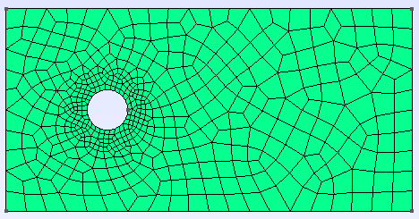
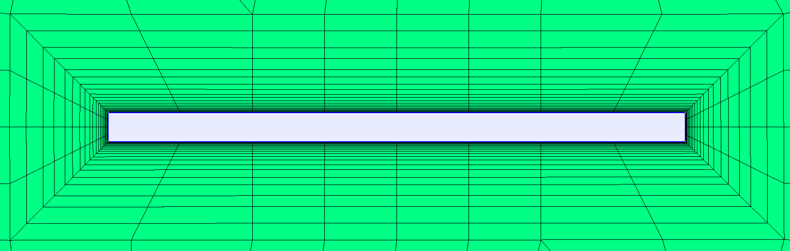
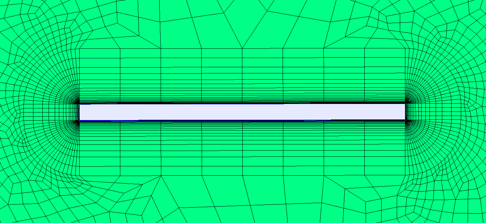
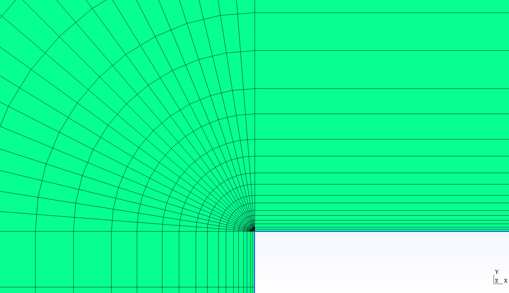
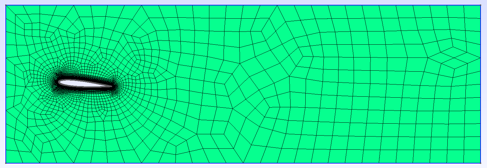
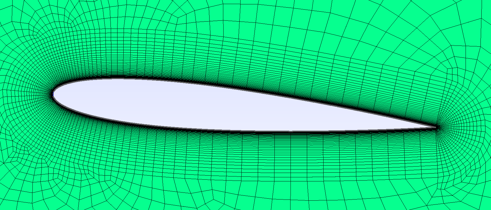

===============================
Introduction on How to Use GMSH
===============================

.. seealso::
	``.geo`` files are available in the `lethe-utils github folder <https://github.com/lethe-cfd/lethe-utils/tree/master/gmsh>`_
	

--------------------------
Installation
--------------------------
See the `GMSH website <https://gmsh.info/>`_ for installation. For the stable release, the GMSH executable needs to be extracted from a compressed file.

.. hint::
	For Linux users, after extracting the TGZ file, it is recommanded to add the ``bin`` folder of the GMSH installation in your ``.bashrc`` script with ``export``. It will be easier to access GMSH.

--------------------------
Geometry
--------------------------
This guide uses mainly this simple geometry:

.. image:: images/geo.png
    :alt: The geometry of a circle in a rectangle
    :align: center
    :name: geometry

""""""""""""""""""""""""""""""""""
Create and Edit the ``.geo`` File
""""""""""""""""""""""""""""""""""
The geometry is written in a ``.geo`` file:

1. Start ``GMSH``
2. ``File > New...``
3. Either use the folders navigator or directly specify the path and filename in ``Filename`` 
    for example: ``/home/<user>/Documents/Mesh/<filename>.geo``
4. Specify the Kernel to use: :ref:`built-in kernel` or :ref:`opencascade kernel`
	* The **Built-in kernel** uses the raw code of GMSH to create a geometry from points, to curves, then surfaces and finally volumes (in 3D).
	* The **OpenCASCADE kernel** uses simplified shapes to create the same geometry with fewer steps.

You can then open the created ``.geo`` file in a simple text editor, either by:

* opening the file in your folder, or
* ``Left pannel: Modules > Geometry > Edit script``

.. warning::
	After each modification in the ``.geo`` file, save it and load the modifications in ``GMSH``:
	    ``Left pannel: Modules > Geometry > Reload script``

.. _built-in kernel:

""""""""""""""""""""""""""
Built-in kernel
""""""""""""""""""""""""""
It is quite easy to create a ``.geo`` file directly by coding line by line the geometry that you want to produce.

.. tip::
	Using a Built-in kernel gives you full control over the geometry creation, which is necessary to create a :ref:`structured mesh` (transfinite) mesh. However, it usually takes more time than using functions available in :ref:`opencascade kernel`.

1. Set the points that delimits the shape being traced. The attribute ``Point`` is essential to set a point of the shape and to specify its coordinates. 
	* For the rectangle, we will have:

	.. code-block::

		// Point(<id>) = {<X>, <Y>, <Z>, <Prescribed mesh size at point>}
		Point(1) = {-5, -5, 0, 1.0};
		Point(2) = {-5, 5, 0, 1.0};
		Point(3) = {15, -5, 0, 1.0};
		Point(4) = {15, 5, 0, 1.0};

	.. hint::
		See :ref:`mesh` for more information about the ``<Prescribed mesh size at point>``.
		
	* For the circle, we need 3 points to trace a circle arc:

	.. code-block::

		Point(5) = {0, 0, 0, 1.0};
		Point(6) = {-1, 0, 0, 1.0};
		Point(7) = {1, 0, 0, 1.0};
	
2. Close the shape with lines. 
	* For the rectangle (straight lines):

	.. code-block::

		// Line(<id>) = {<id of start point>, <id of end point>}
		Line(1) = {1, 2};
		Line(2) = {2, 4};
		Line(3) = {4, 3};
		Line(4) = {3, 1};
	
	* For the circle arcs:

	.. code-block::

		// Circle(<id>) = {<id of start point>, <id of middle point>, <id of end point>}
		Circle(5) = {6, 5, 7};
		Circle(6) = {7, 5, 6};

	.. warning::
		``Circle`` are also considered as ``Line``, so the ``<id>`` needs to differ from the ``Line`` ones.

3. Close the lines with ``Curve Loop`` and then create a surface out of it with ``Plane Surface``. The final plane surface will be delimited by the curve loops of both the rectangle and the circle.

.. code-block::

	// Curve Loop(<id>) = {<id of line>, ...}
	Curve Loop(1) = {1, 2, 3, 4};
	Curve Loop(2) = {5, 6};
	// Plane Surface(<id>) = {<id of curve loop>, ...}
	Plane Surface(1) = {1, 2};
	
.. tip::
	All the lines of code can be directly made with the GUI of gmsh with some clicks and keyboard shortcuts.

.. _opencascade kernel:

""""""""""""""""""""""""""
OpenCASCADE Kernel
""""""""""""""""""""""""""
In the GMSH geometry section of the GMSH GUI (see ``Left pannel: Modules > Geometry > Elementary entities > Add``), you can add directly multiple 2D or 3D common geometries with a simple click thanks to OpenCASCADE kernel. GMSH will automatically open a window where you can easily set the characteristic lenghts of the geometry, and update the ``.geo`` file.

.. warning::
	Always save your ``.geo`` file in your text editor before modifying it through the GMSH GUI. If you modify the ``.geo`` file without saving it, GMSH will not update it. 

For our example (circle in a rectangle in 2D):

1. Select the ``Disk`` geometry available with OpenCASCADE, set the radius to 1 (for X and Y) and center it at :math:`(x,y)=(0,0)`. 
2. Select the ``Rectangle`` geometry, set the length (``DX``) to :math:`20`, the width (``DY``) to :math:`10` and the left bottom corner to :math:`(x,y)=(-5,-5)`.
    
.. note::
	If you click on ``Edit script``, you will see that the OpenCASCADE kernel has been added to the code as ``SetFactory("OpenCASCADE");``. 

	The rectangle is set with ``Rectangle(1) = {-5, -5, 0, 20, 10, 0};`` and the circle with ``Disk(2) = {0, 0, 0, 1, 1};``.
	
.. tip::
	The ``Disk`` and ``Rectangle`` are already considered as surfaces in gmsh, there is therefore no need to pass from points, to curves and then surfaces. 

3. Remove the disk surface from the rectangular domain, with OpenCASCADE boolean operation, either via the GUI (``Geometry > Elementary entities > Boolean``) or the code:

.. code-block::
	
	// BooleanDifference{ Surface{<id of surface to keep>}; Delete; }{ Surface{<id of surface to remove>}; Delete; }
	BooleanDifference{ Surface{1}; Delete; }{ Surface{2}; Delete; }
	
""""""""""""""""""""""""""
Import CAD File
""""""""""""""""""""""""""
Importing CAD files (``.step`` or ``.stp`` format) can be particularly convenient for more complex fluid geometries (like pipes) or immersed solids (like an impeller):

.. hint::
  In the case of immersed solids, use a simplified CAD file of the outer shell of the solid, e.g. without any screws or bolts or threads.

1. ``File > New...``: create a new .geo file (can use OpenCASCADE or Built-in kernel)
2. ``Files > Merge...``: merge the CAD file (``.step`` or ``.stp`` format) with GMSH
3. ``Tools > Statistics``: check that the geometry is loaded (point, curves, surfaces, and volumes in 3D)

.. seealso::
  You can find a step-by-step video `here <https://www.youtube.com/watch?v=e7zA3joOWX8>`_, with very useful tools as how to inspect your mesh.

--------------------------
Physical Groups
--------------------------

.. warning::
	This step is essential. Physical groups are used to identify the boundary conditions.

In 2D, the physical groups are curves and in 3D, surfaces. For this example, select ``Curve`` in the ``Modules > Geometry > Physical groups > Add`` section. Four different physical groups with ``Curve`` is needed:

1. Click on the left line of the geometry for the inlet condition.
2. Click on the top and bottom lines for the slip condition.
3. Click on the circle for the no slip condition.
4. Click on the right line for no condition.

By reloading the script, you will see those four lines of code appear:

.. code-block::
	
	// Physical Curve(<id>) = {<id of curve element>, ...}
	Physical Curve(1) = {7};
	Physical Curve(2) = {6, 9};
	Physical Curve(3) = {5};
	Physical Curve(4) = {8};
	
.. important::
	The ``bc #`` in the ``.prm`` files (:doc:`../../parameters/cfd/boundary_conditions_cfd`) must be the same as the ``id`` specified for the physical group.

Then, add a ``Physical Surface`` for a 2D geometry, or a ``Physical Volume`` for a 3D geometry. 

.. warning::
	All cells must be in a Physical group.
	
	While not adding a ``Physical Surface`` or ``Volume`` would not prevent GMSH from building the mesh, it would result in an error when the mesh is loaded by deal.II. This is often a source of error.

.. code-block::
	
	// Physical Surface(id) = {<id of surface element>, ...}
	Physical Surface(1) = {1};
	
Then, define the boundary conditions accordingly in the parameter file :

.. code-block:: text

	subsection boundary conditions
	  set number                  = 4
	  subsection bc 0
		set id                = 1
		set type              = function
		subsection u
		    set Function expression = 1
		end
		subsection v
            	    set Function expression = 0
        	end
	  end
	  subsection bc 1
	  	set id                = 2
		set type              = slip
	  end
	  subsection bc 2
	  	set id                = 3
		set type              = noslip
	  end
	  subsection bc 3
	  	set id                = 4
	  	set type              = none
	end

.. _mesh:

---------------------------
Mesh
---------------------------

""""""""""""""""""""""""""
Unstructured
""""""""""""""""""""""""""
Basic:

1. (optional) ``Tools > Options > Mesh`` and ``General`` panel, check ``Recombine all triangular meshes``: generate a quad mesh.
2. (optional) In the same panel, change ``Min/Max element size`` to have smaller/bigger elements, therefor a finer/coarser mesh.
3. ``Left pannel: Modules > Mesh > 2D`` or ``3D``: create the mesh
4. ``Tools > Statistics``: check that the mesh is generated appropriately (by default, triangles for 2D and hexahedra for 3D)
5. (optional) ``Left pannel: Modules > Mesh > Refine by splitting``: refine the mesh (beware, it takes more and more time for each refinement)
6. ``Left pannel: Modules > Mesh > Save``: save the mesh in a ``.msh`` file, to be used in Lethe (see :doc:`../../parameters/cfd/mesh`)

By following all the previous steps, the mesh generated looks like below.

.. image:: images/unstructured.png
    :alt: 2D mesh with quads
    :align: center
    :name: unstructured mesh

""""""""""""""""""""""""""""""""""""
Attractors for Local Mesh Refinement
""""""""""""""""""""""""""""""""""""
Attractors can also be used to refine the mesh towards specific edges or surfaces. In this example, attractors could be interesting if the mesh needs to be finer around the sphere. Attractors can only be added by code with the ``Field`` attribute.

.. code-block::

	// LcMax -                         /------------------
	//                               /
	//                             /
	//                           /
	// LcMin -o----------------/
	//        |                |       |
	//     Attractor       DistMin   DistMax

1. Set the attractor:

.. code-block::

	Field[1] = Attractor;
	
2. Specify where the refinement needs to be done (near the circle in this case):

.. code-block::

	Field[1].EdgesList = {5};
	
3. Set the minimum/maximum characteristic length and the minimum/maximum distance of the refinement:

.. code-block::

	Field[2] = Threshold;
	Field[2].IField = 1;
	Field[2].LcMin = 0.25;
	Field[2].LcMax = 1;
	Field[2].DistMin = 1;
	Field[2].DistMax = 2;
	
4. Apply the attractor:

.. code-block::

	Background Field = 2;
	
Here is the mesh generated with an attractor around the sphere:

.. _structured mesh:

""""""""""""""""""""""""""
Structured - Quad Mesh
""""""""""""""""""""""""""
.. warning::
	The ``.geo`` file must be built with the :ref:`built-in kernel`.

Creating a structured quad-mesh usually takes a lot more time than an unstructured quad-mesh, but provides a full control on the mesh generation. To do so:

1. Create the geometry accordingly and add construction elements where needed

.. tip::
	Converting an unstructured mesh to a structured mesh usually requires rewritting a good part of the geometry. Begin by drawing by-hand and check that all of your surfaces have only four points each.

2. Define ``Transfinite Line`` (before ``Line Loop``), with:
	
.. code-block::

	// Transfinite Loop {<id>, ...} = <number of divisions> Using Progression <num>;

3. Define the ``Line Loop`` (or ``Curve Loop``) and ``Plane Surface`` as for a regular mesh

4. Define ``Transfinite Surface`` (instead of ``Plane Surface``) and recombine them to get a quad mesh:

.. code-block::

	// Recombine Surface {<id>}

5. Generate the mesh

.. seealso::
  You can find a step-by-step `video <https://youtu.be/1A-b84kloFs?t=316>`_, with a similar geometry (cylinder in flow). 

A mesh can also be partially structured, to better encounter for a boundary layer for instance: see the ``.geo`` file provided with the :doc:`../../examples/incompressible-flow/2d-transient-flow-around-ahmed-body/2d-transient-flow-around-ahmed-body` example. 

.. _tips:

""""""""""""""""""""""""""
Boundary Layer Mesh
""""""""""""""""""""""""""

Some problems require special attention in the vicinity of surfaces, especially when one wishes to take into account boundary layer effects. Gmsh is equipped with tools to mesh geometries to obtain high accuracy near surfaces: transfinite meshes and the Field Boundary Layer.
This section first gives an example of the use of the Field Boundary Layer in a simple case. An application on a more complex geometry, a naca0012 airfoil will be shown at end. The ``.geo`` and ``.msh`` will be available in an example very soon.

First, we define the geometry: a rectangular plate in a square enclosure. We want to mesh the area between the two objects. Without further parameterization of the .geo, we obtain the following mesh:

.. image:: images/boundaryLayer/basicMesh.png
    :alt: The surface is meshed without specific instructions around the plate
    :align: center
    :name: basic mesh
    :width: 400

We will now use one of the many fields offered by gmsh. These objects allow you to perform various operations on the mesh: define a box where to mesh more finely, calculate a field of distances to a precise point and combine with a Threshold etc. We are interested in the Field BoundaryLayer which allows, given curves and points, to make a boundary layer mesh in the neighbourhood of these entities. The parameters are the following (for an exhaustive list of parameters and possibilities, see the `user manual <http://gmsh.info/dev/doc/texinfo/gmsh.pdf>`_   p303-304):

1. Set the BoundaryLayer Field:

.. code-block::

	Field[1] = BoundaryLayer;
	
2. Specify the curves which define your boundary:

.. code-block::

	Field[1].CurvesList = {5,6,7,8};

	
3. Set the desired characteristics of the boundary layer, size of the elements close/far to the surface, size ratio between two successive layers and maximal thickness of the boundary layer: 

.. code-block::

        Field[1].SizeFar = 1; 
        Field[1].Size = 0.004;
        Field[1].Ratio = 1.5; 
        Field[1].Thickness = 1; 
	
4. Specify if the elements must be quadrangles and apply the field:

.. code-block::

        Field[1].Quads = 1; 
        BoundaryLayer Field = 1;
	
Here is the mesh generated with the previous settings around the plate:

    
5. The result is interesting, although the elements at the corners are skewed. This can be solved by feeding the field a list of the points at the corners which will be defined as FanPoints. Then, one may refine the mesh by specifying a number of elements for each fan. Alternatively, the size can be defined as the same for all points, see the commented line below.

.. code-block::

        Field[1].FanPointsList = {5,6,7,8}; 
        Field[1].FanPointsSizesList = {17,17,17,17}; 
        //Mesh.BoundaryLayerFanElements = 17;

We obtain the following mesh which is much better to account for boundary layer effects: 

If we take a closer look at the surface, the geometric progression of the sizes of elements becomes visible: 

The mesh around the angle looks like this: 

.. image:: images/boundaryLayer/angle.png
    :alt: The angles are also meshed accordingly
    :align: center
    :name: fan boundary layer mesh
    :width: 600
 

You now know everything about boundary layer meshing. Here is an example on a naca0012 airfoil profile. The ``.geo`` will be available on a future example very soon.

.. image:: images/boundaryLayer/voisinageFan.png
    :alt: The trailing edge requires a specific meshing to simulate the phenomenas happening here
    :align: center
    :name: fan Naca
    :width: 600

--------------------------
Other Tips
--------------------------
- Use variables and functions to make your ``.geo`` file more adaptative
	* Example: 

	.. code-block::

		//Parameters
		L = 5; 			//length
		C45 = Cos(45*Pi/180); 	//cosine of 45 degrees
		esf = 1.2; 		//element size factor

		//Points
		Point(1) = {L, L*C45, 0, esf};

- Use the ``Visibility`` option to get the ID of an element or a physical group easily on the GUI: 
	* ``Tools > Options > Mesh > Tab: Visibility``
	* Check the adequate boxes (for example ``1D element labels`` for points, etc.) 
	* Choose the label type in the drop-down menu ``Label type`` (for example ``Elementary entity tag``).

- You can define a range of elements to group, and if an index does not exist it is simply not considered. Use it to define ``Physical Surface`` (2D) or ``Physical Volume`` (3D) for the whole geometry more easily.
	* For example: ``Physical Surface(1) = {1:200};``

- Click on the grey bar at the bottom of the software interface to see all the logs, errors and warnings.

- Verify your mesh in: ``Tools > Statistics > Mesh``. In particular, make sure that you only have one type of elements. If not, changing the mesh refinement can help removing unwanted triangles in a quad mesh.

- ``negative cells`` or ``cells volume < 0`` is a classical error that deal.II can trigger when importing a mesh generated with GMSH. This indicates that at least some of your ``Curve Loop`` or ``Line Loop`` are not defined with the same orientation (clockwise or counter-clockwise). Inspect your mesh with GMSH GUI: 
	* The cells should be drawn with color lines, different for each surface. 
	* A surface with black cells indicates that it is not in the correct orientation. Change the definition of the loop in the ``.geo`` file
		* Example: ``Curve Loop(1) = {1, 2, 3, 4};`` instead of ``Curve Loop(1) = {1, 4, 3, 2};``

