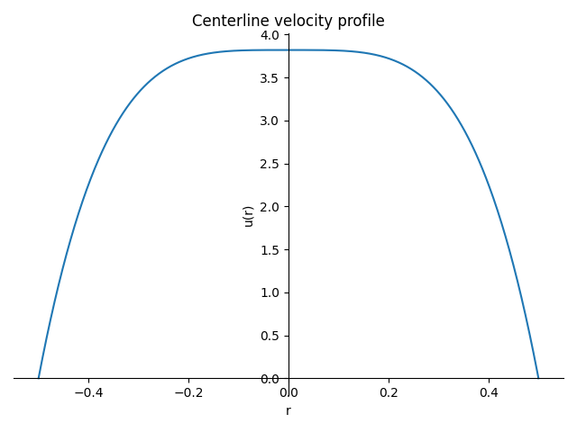

########################
Inlet profile generator
########################

This tool is a simple Python script that generates a polynomial function to use as inlet boundary condition for the flow.

The output of the script is a polynomial function that can be used in the ``Function expression`` parameter of a ``inlet`` boundary condition for the velocity.

It can be found in the ``/contrib/utilities/inlet_profile_generator`` folder of the Lethe repository.

To run the script you just need to have `SymPy <https://www.sympy.org/en/index.html>`_ installed in your Python environment.

The script has the following arguments:

* ``--dimension`` or ``-d``: Dimensions of the profile. This variable stands for the dimensions of the boundary. For instance, in a 2D simulation, your boundary face is 1D, so this argument should be 1. Supported dimensions are ``1`` and ``2``. Default is ``2``.
* ``--polynomial-degree`` or ``-pd``: Degree of the polynomial to be generated. Default is ``2``. To prevent negative flow velocities, we always use even degrees.
* ``--shape`` or ``-s``: Shape of the inlet. Supported shapes are ``rectangle`` and ``circle``. Default is rectangle.
* ``--flow-rate`` or ``-fr``: Volumetric flow rate to be imposed at the inlet. Default is ``1``.
* ``--center`` or ``-c``: Coordinates of the center of the inlet. Default is ``0. 0.``.
* ``--length`` or ``-l``: Length associated to the inlet shape. If the shape is a rectangle, use ``a,b``, where ``a`` is the length in the x direction and ``b`` is the length in the y direction. If the shape is a circle, give the diameter of. Default is ``1. 1.`` for rectangle and ``1.`` for the circle.
* ``--number-significant-digits`` or ``-n``: Number of significant digits to be used in the output polynomial. Default is ``5``.
* ``plot`` or ``-p``: Used for plotting the generated profile obtained by the script. If ``True`` plots of velocity as a function of ``x`` at center ``y``` and velocity as a function of ``y``` at center ``x`` are shown. Default is ``False``.

Running the script is as simple as:

.. code-block:: bash
    :class: copy-button

    python3 inlet_profile_generator.py --polynomial-degree 4 --shape circle --flow-rate 2 --center 0. 0. --length 1. --plot

The output of this command is:

.. code-block:: text

    === Inlet velocity profile u(x,y) (SymPy expression) ===

    (-192.0*x^4 - 384.0*x^2*y^2 - 192.0*y^4 + 12.0)/pi

    Plotting centerline u(r) with SymPy...

With the following plot:

