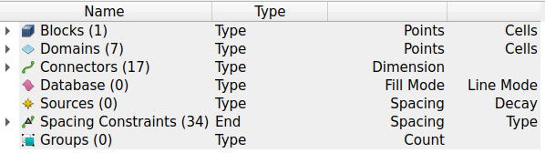
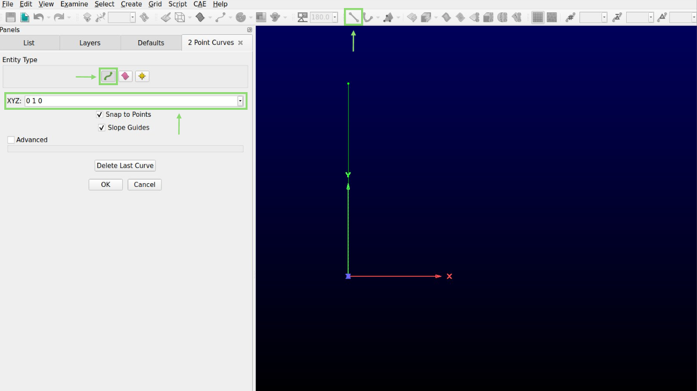

=====================================
Introduction on How to Use Pointwise
=====================================

This guide provides a brief overview of the core functionalities of the Fidelity Pointwise software. The content of this tutorial is divided as follows:  

- :ref:`Installation <installation>`
- :ref:`Basics <basics>`
- :ref:`Making your first 2D Geometry <making_2D_geo>`
- :ref:`Moving to 3D <moving_3d>`

.. _installation: 

--------------------------
Installation
--------------------------

Fidelity Pointwise is a proprietary mesh generation software. To download it, please refer to the official instructions provided by the Fidelity `Pointwise documentation <https://www.pointwise.com/doc/user-manual/>`_ or to the designated person in your group.

For Linux users, start by extracting the .tgz file that holds the software. Open a terminal and move to the directory where you extracted the file. Make the file executable:

.. code-block:: text
    
    chmod +x <your_file>.sh

Execute the installation file using the following command:

.. code-block:: text

    ./<your_file>.sh

At the end of the installation, add the following to your ``.bashrc`` system file:

.. code-block:: text

    #Pointwise license
    export CDS_LIC_FILE=<your_license_server_ip_adress>
    export LD_PRELOAD=/usr/lib/x86_64-linux-gnu/libstdc++.so.6

    #Launch pointwise
    alias pointwise=~/Fidelity/Pointwise/Pointwise2023.1.1/pointwise

Make sure to modify ``your_license_server_ip_adress`` with the actual license server IP address so it can be accessed by the software. After these modifications, you can launch pointwise by entering ``pointwise`` in the terminal.

.. _basics: 

--------------------------
Basics
--------------------------

First, let us familiarize ourselves with some basic controls and important interface functionalities.

----

Moving Around
--------------

To move around, use:

- ``shift + right-click``: Linearly translate the geometry.
- ``ctrl + right-click``: Rotate the geometry around the currently defined axis.

----

Entities
----------

The **Entities** are the different objects that can be created using Pointwise. They are shown below:

The principal ones are:

- **Connectors**: 1D grid element that is the foundation of all other grid hierarchies.
- **Domains**: 2D grid element assembled using connectors.
- **Blocks**: 3D grid element assembled using domains.

 .. warning::
    Only the **blocks**, **domains** and **connectors** are specifically used to create meshes. The other entities are employed in specific cases. See the `Pointwise manual <https://www.pointwise.com/doc/user-manual/index.html>`_ for more information.

An example of the three principal entities is displayed in the image below.

----

Menu Bar
--------------------

Here is a short description of the different menus located on the top of the graphical interface:

- ``File``: Opens and saves Fidelity Pointwise Project Files and imports or exports files from other systems.
- ``Edit``: Contains Undo, Redo, and commands for modifying entities.
- ``View``: Has controls for various Display window view orientations and the overall layout of panels and toolbars.
- ``Examine``: Provides ways to get detailed information about grid quality and other aspects of the grid.
- ``Select``: Includes various ways of selecting entities and controls for selection behavior.
- ``Create``: Builds new database and grid entities.
- ``Grid``: Applies Fidelity Pointwise's grid methods to improve grid quality.
- ``Script``: Provides Glyph scripting and journaling controls.
- ``CAE``: Sets the analysis software type and dimensionality which Fidelity Pointwise will export to, and is also used to set boundary and volume conditions.
- ``Help``: Provides access to the Fidelity Pointwise help system.

----

Toolbar
------------------

Some functionalities contained in the menu bars are easily accessible through the toolbar. Here are some of the most used ones.

The **Two Points Curve** and the **Draw Curve** displayed below can be used to create connectors: 

.. centered::
    |pic1|  |pic2|

.. |pic2| image:: images/icon_curve.png

The symbol of the wrench over the domain and block are shortcuts to **Assemble Domains** and **Assemble Blocks**:

.. centered::
    |pic3|  |pic4|

The three boxes displayed below are used to dimension connectors and to distribute the points along them:

.. image:: images/toolbar_grid.png
    :align: center
    :width: 500px

- Left box: Specify the number of points on a connector. 
- Middle box: Specify the average distance between points on a connector
- Right box: Enforce a non-uniform distribution of points on a connector.

The **mask** is situated at the extreme right of the software's window. It lets you choose which entities are selectable.

.. image:: images/toolbar_mask.png
    :align: center
    :width: 500px

----

Useful Shortcuts
----------------

Here is a list of some keyboard shortcuts:

- ``ctrl + k``: Assemble Domains (Assemble connectors to create a 2D mesh)
- ``ctrl + shift + k``: Assemble Blocks (Assemble domains to create a 3D mesh)
- ``ctrl + f``: Next Edge (Confirm the edge selection of the quadrilateral)
- ``ctrl + j``: Join (join two connectors)
- ``ctrl + q``: Split (split a connector)
- ``ctrl + shift + right-click``: Change axis (Snap the position of the rotational axis to a new point)
- ``middle-click``: Get the current position (get position and distance from the last click)
- ``F2``: Zoom to extent (adjust the zoom to the edge of the geometry)

.. _making_2D_geo: 

--------------------------------
Making your first 2D Geometry
--------------------------------

This section will give you a good idea of the tools that can be used to create the following 2D mesh.

.. image:: images/final_mesh.png
    :align: center

----

Assembling the geometry
-----------------------

- Select the **2 Point Curve** symbol in the shortcut bar at the top of the pointwise window.

- Make sure the entity type is set to **Connector** (the green curved line). 

- In the XYZ box, enter the coordinates **0 0 0** of the first point of the **2 Point Curve** and press enter. Reselect the XYZ box. Enter the coordinates **0 1 0** of the second point of the **2 Point Curve** and press enter again. This will create the left wall of our geometry.

.. warning::
    A majority of the meshes can be assembled by only using connectors. **Database entities** (the pink squiggly rectangle) are your worst enemies if you are not using imported CAD geometries. 

At this point, you should have a vertical **connector** that starts from the origin (0, 0, 0) to the point (0, 1, 0) as is displayed in the image below.

- Now that your first connector is created, add 7 other connectors to complete the geometry. (0, 1, 0) to (1, 1, 0), (1, 1, 0) to (1, 0.5, 0), (1, 0.5, 0) to (0.5, 0.5, 0), (0.5, 0.5, 0) to (0.5, 0, 0), (0.5, 0, 0) to (0, 0, 0), (0.5, 0.5, 0) to (0, 0.5, 0) and (0.5, 0.5, 0) to (0.5, 1, 0)

.. tip::

    In a hurry? You can enter a coordinate by clicking wherever you want on the geometry. A small target lets you snap the point directly at the extremity of a connector. 

The final geometry should look like this.

.. image:: images/connectors.png
    :align: center

Few geometries are nice convex quadrilaterals. Concave shapes generally lead to low-quality meshes. It is therefore ideal to separate the geometry into trapezoidal or rectangular sections that will facilitate the meshing process. This is exactly the purpose of the last two created connectors. Separating the weird elbow into squares will improve the overall quality of the generated mesh.

The subsequent step involves dividing the top and left long connectors. This is done to ensure they do not interfere with the meshing of the other regions.

- Select the top connector and go to the option **Edit** and **Split** at the top of the page. Enter 50 in the **Percent of Length** to split the connector in half. Repeat the same process for the left connector. Without this step, the meshing process is impossible.

.. image:: images/split.png
    :align: center

----

Generating the mesh
--------------------

By default, the created connectors have no dimension. However, this is the metric that determines the degree of refinement of the resulting mesh. Assigning a dimension to every connector before meshing is therefore a crucial step. The dimension of the connector is the number of points distributed on the 1D geometry. A 12x12 mesh is constituted of four connectors of size 13. 

- Select all the connectors and enter 20 (or whatever desired number) in the **Dimension** box. It is located at the top of the window beside the hashtag as shown in the image below.

.. image:: images/connectors_dimension.png
    :align: center

- To assemble the mesh, go to the **Create** option, select **Assemble special** and **Domain**. A new window with a square should appear on the right side of your screen. Select the first side of the square and click the **Next Edge** button in the **Assemble Domain panel**. The yellow line in the picture should turn red.

.. image:: images/assemble_domains.png
    :align: center

.. warning::
    A structured mesh is created by selecting a closed quadrilateral of **connectors**. The quadrilateral can contain more than 4 connectors. However, the opposing sides of that quadrilateral **must** have the same dimension. 

- Repeat the process for the four sides of the first square. After the second border of the quadrilateral has been confirmed, the mesh should complete itself. Repeat for the other two squares. The final result should look like this.

.. image:: images/assemble_domains2.png
    :align: center

.. warning::
    If a mistake was made in the first steps, they generally manifest at this exact moment. Here are some common mistakes to look into if the mesh is not correctly generated.

    - **Next Edge** was not selected before clicking on the next side of the square.
    - The connectors are dimensionless.
    - A line is not correctly connected to its neighboring line.
    - The dimensions of the connector on the opposite side do not match.
    - A line was not split when the geometry was separated into subsections. 

----

Assigning the boundary conditions and exporting the mesh
---------------------------------------------------------

- In the **CAE** option, select **Set Dimension** and choose 2D.

- Go to the **CAE** option and choose **Select Solver**. In the list on the left of the screen, select **GMSH**.

- In the **CAE** option, select **Set Boundary Conditions**. Click **New**. Change the **Name** of the new box by double-clicking on it and insert **wall**. Select all the walls in the geometry (hold the ``ctrl`` button on your keyboard as you click) as is presented in the following image and click on the little check box at the left of the name box that was just changed. All the walls should be moved to that set of boundary conditions. The number 6 indicates that 6 boundaries were just moved to that set of boundary conditions. 

.. image:: images/boundary_conditions.png
    :align: center

- Repeat the previous step for the inlet and outlet boundary conditions.

.. image:: images/boundary_conditions2.png
    :align: center

- To export the 2D mesh, select all the domains. In the **file** option, select **export** and **CAE**. Choose a name for the .msh file and press save. Your mesh should be done!

.. warning::
    The Deal.II mesh file parser cannot read the comments in the ``.msh`` file generated by Pointwise. Make sure to delete manually all the commented information in the file before launching a simulation.
 
The boundary conditions identification numbers are chosen by Pointwise. The user has no control over the software's decision. The boundary condition IDs can be retrieved at the end of the ``.msh`` file generated. In the present case, the boundary IDs would correspond to 2 for the inlet, 3 for the outlet and 4 for all the walls.

.. code-block:: text
    
    $PhysicalNames
    4
    2 1 "Unspecified"
    1 2 "inlet"
    1 3 "outlet"
    1 4 "walls"
    $EndPhysicalNames

.. _moving_3d: 

--------------------------
Moving to 3D
--------------------------

This section will give you an idea of the tools that can be used to create the following 3D mesh.

----

Extrusions
-----------

The best way to create 3D **block** meshes from 2D geometries is by using extrusions. The following steps can be achieved from the final 2D geometry generated previously. 

- **Set Dimension** to 3D in the **CAE** menu
- Select all the geometry and click on **Translate** in the **Edit** and **Transform** menu.
- Insert **0.5 0 0** in the **Offset Vector** box and press enter. Click on **ok** to leave the menu. 

.. image:: images/translation.png
    :align: center

The last action should have translated the geometry from 0.5 in the x direction.

.. warning::
    Lethe cannot solve problems containing tetrahedral cells. This translation is needed to avoid their creation in the center during the rotational extrusion. 

- In the **Create** menu, select **Extrude** and **Rotate**
- Click **Done** after the first menu appears. Enter the desired number of cells in the **Steps** box. 50 is used in this example.
- Insert 360 in the **Angle** box.
- Select the **Point and Direction** option. Insert the point **0 0 0** in the **XYZ** box and choose the Y direction.
- Click the **Run** button on the top.  

The following mesh should be obtained at the end of these steps.

.. image:: images/final_mesh_no_center.png
    :align: center

----

Filling the center
--------------------

An initial translation makes sure no tetrahedral is created at the center of the mesh. The interior of the inlet must however be filled.
The next step will guarantee the hole created is filled.

- Split the 3 inner round connectors into 4 parts using the **Split** tool in the **Edit** menu. These connectors are distributed along the y-axis and should have a diameter of 1. 

.. image:: images/split_3d.png
    :align: center

- Generate a square on the bottom of the hole of the geometry with the **2 Point Curve**. The four coordinates of the corner of the square are (0.25, 0, 0), (-0.25, 0, 0), (0, 0, 0.25) and (0, 0, -0.25)
- Connect the edges of the square to the lowest points that appeared after the splitting of the inside connectors.

The image below represents the current state of the geometry. 

At this point, there is a problem in the geometry. The previous separation created connectors of uneven dimensions. Hovering the mouse over the inside connectors quickly shows in the bottom right corner that some are of size 14 while some are of size 13. However, the opposing sides need to be equal in a structured mesh. Some inside, middle and outside connectors will need to be modified.

- Change the size of all the inner horizontal connectors to 14 and of the middle and outer horizontal connectors to 53. This can be achieved using the **Set Dimension** hashtag box in the toolbox section.
- Mesh the bottom face of the newly created geometry using the **Assemble Special** and **Domains** in the **Create** menu

The geometry should be identical to the following picture.

The last step is to extrude the new face at the bottom to fill the cavity. 

- Select the bottom connectors and domains of the interior of the hole. In the **Create** menu, select **Extrude** and **Path**.
- Select the two vertical connectors along which the face must be extruded and press the **Run** button.

.. image:: images/filling3.png
    :align: center

And just like that, your first 3D geometry is completed!
