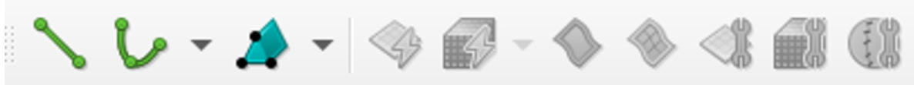

=====================================
Introduction on How to Use Pointwise
=====================================

This guide gives provides a brief overview of the core functionalities of the Fidelity Pointwise software. The content of this tutorial is divided as follow:  

- :ref:`Installation <installation>`
- :ref:`Interface overview <interface>`
- :ref:`Make your first 2D Geometry <making_2D_geo>`
- :ref:`Tips and tricks <tips>`

.. _installation: 

--------------------------
Installation
--------------------------

Fidelity Pointwise is a  mesh generation proprietary software. To download it, please refer to the
official instructions provided by the Fidelity Pointwise documentation or to the designated person in your group.

For Linux users, start by extracting the .tgz file that holds the software. Open a terminal and move to the directory where you extracted the file. Make the file executable.

.. code-block:: text
    
    chmod +x your_file.sh

Execute the installation file using the following command.

.. code-block:: text

    ./your_file.sh

At the end of the installation, add the the following to your ``.bashrc`` system file:

.. code-block:: text

    #Pointwise license
    export CDS_LIC_FILE=license_server_ip_adress
    export LD_PRELOAD=/usr/lib/x86_64-linux-gnu/libstdc++.so.6

    #Launch pointwise
    alias pointwise=~/Fidelity/Pointwise/Pointwise2023.1.1/pointwise

Make sure to modify the ``license_server_ip_adress`` with the actual license server IP adress so it can be accessed by the software. After these modifications, you can launch pointwise by entering ``pointwise`` in the terminal.

.. _interface: 

--------------------------
Interface overview
--------------------------

First, lets get familiar with some basic controls and some important functionalities of the interface.

Moving around
--------------

To move around, use the ``shift + right click`` and ``ctrl + right click``. The first one lets you shift the geometry around in a linear fashion while the second one lets you rotate the geometry around the axis.

Menu bar and toolbar
--------------------

Here is a short description of the different menu bars located on the top of the displayed window:

- ``File``: Is used for opening and saving Fidelity Pointwise Project Files and importing and exporting files from other systems.
- ``Edit``: Contains Undo, Redo, and commands for modifying entities.
- ``View``: Has controls for various Display window view orientations and the overall layout of panels and toolbars.
- ``Examine``: Provides ways to get detailed information about grid quality and other aspects of the grid.
- ``Select``: Includes various ways of selecting entities and controls for selection behavior.
- ``Create``: Is used to build new database and grid entities.
- ``Grid``: Is used to apply Fidelity Pointwise's grid methods to improved grid quality.
- ``Script``: Provides Glyph scripting and journaling controls.
- ``CAE``: Is used to set the analysis software type and dimensionality which Fidelity Pointwise will export to, and is also used to set boundary and volume conditions.
- ``Help``: Provides access to the Fidelity Pointwise help system.

Even if the menu bar exists, a lot of the useful fonctionalities can be accessed quickly in the toolbar that is just below. Lets look at some of the most valuable ones.

The **mask** is probably the most important tool. It is situated at the extreme right of the software's window. It lets you choose which entities are selectable. At this point the different entities have not been introduced so lets make a quick overview of some of them.

Starting from the left is the **block mask**. A **Block** represents a section of a 3D mesh. It is composed of **Domains** which are the 2D equivalent of **Blocks**. These **Domains** are constituted of **Connectors** which are the 1D equivalent of **Domains**.

So in short, to create a 3D mesh, it is first necessary to create all the structure of the geometry using connectors. The connectors can then be assembled as domains and the domains can finally be assembled as blocks. An exemple of the three different entities is present in the image down below. The other entities are not useful for the time being. Some of them will be revisited in the last section of this tutorial.

.. image:: images/block_domain_connector.png
    :align: center

The next important part of the toolbar is displayed below. The two point curve and the draw curve can be used to create connectors. The symbol of the wrench over the domain and block are shortcuts to assemble domains and blocks. Another more efficient way to assemble domains will be presented further into this guide.

Finally, lets look at the two boxes in this last presented part of the toolbar. The first one can be used to specify the number of points on a connector. The second lets the user specify the distance between every points.

.. image:: images/toolbar_grid.png
    :align: center
    :width: 500px

Useful shortcuts
----------------

Here is a list of some keyboard shortcuts that are useful to remember:

- ``ctrl + k`` : Assemble Domains (Assemble connectors to create a 2D mesh)
- ``ctrl + shift + k`` : Assemble Blocks (Assemble domains to create a 3D mesh)
- ``ctrl + f`` : Next Edge (Confirms the edge selection of the quadrilateral)
- ``ctrl + j`` : join (join two connectors)
- ``ctrl + q`` : Split (split a connector)
- ``ctrl + shift + right click`` : Change axis (get position and distance from last click)
- ``middle click`` : Get current position (get position and distance from last click)
- ``F2`` : Zoom to extent (adjust zoom to the edge of the geometry)

.. _making_2D_geo: 

----------------------------
Make your first 2D Geometry
----------------------------

This section will give you a good idea of the tools that can be used to create the following 2D mesh.

----

Assembling the geometry
-----------------------

- Select the **2 Point Curve** symbol in the shortcut bar at the top of the pointwise window.

- Make sure the entity type is set to connector (the green curved line). A majority of the meshes can be assembled by only using connectors. The database entity type (the pink squigly rectangle) is your worst ennemy if you are not using imported CAD geometries. 

- In the XYZ box, enter the coordinates **0 0 0** of the first point of the **2 Point Curve** and press enter. Reselect the XYZ box. Enter the coordinates **0 1 0** of the second point of the 2 Point Curve and press enter again. This will create the left wall of our geometry.

At this point, you should have a vertical connector that starts from the origin (0,0,0) to the point (0,1,0) as is displayed in the image below.

.. image:: images/two_point_curve.png
    :align: center

- Now that your first connector is created lets add 7 other connectors to complete the geometry. (0 1 0) to (1 1 0), (1 1 0) to (1 0.5 0), (1 0.5 0) to (0.5 0.5 0), (0.5 0.5 0) to (0.5 0 0), (0.5 0 0) to (0 0 0), (0.5 0.5 0) to (0 0.5 0) and (0.5 0.5 0) to (0.5 1 0)

.. tip::

    In a hurry? You can enter a coordinate by clicking wherever you want on the geometry. A small target lets you snap the point directly at the extremity of a connector. 

The final geometry should look like this.

.. image:: images/connectors.png
    :align: center

Few geometries are nice convex quadrilaterals. Concave shapes generally lead to low quality meshes. It is therefore ideal to separate the geometry in trapezoidal or rectangular sections that will facilitate the meshing process. This is exactly the purpose of the last two created connectors. Separating the weird elbow into squares will improve the overall quality of the generated mesh.

The next step divides the long connectors from the top and left so that they only contribute to the meshing of a subsection of the geometry.

- Select the top connector and go to the option **Edit** and **Split** at the top of the page. Enter 50 in the **Percent of Length** to split the connector in half. Repeat the same process for the left connector. Without this step, the meshing process will be impossible.

----

Generating the mesh
--------------------

By default, the created connectors have no dimension. However, this is the metric that determines the degree of refinement of the resulting mesh. Assigning a dimension to every connector prior to meshing is therefore a crucial step. The dimension of the connector is the number of points distributed on the 1D geometry. A 12x12 mesh is therefore constituted of four connectors of size 13. 

- To assign a dimension to the connector, select all the connectors and enter 20 (or whatever desired number) in the **dimension** box. It is located at the top of the window beside the green hashtag as shown in the image below.

- To assemble the mesh, go to the **Create** option, select **Assemble special** and **Domain**. A new window with a square should appear on the right side of your screen. Select the first side of the square and click the **Next Edge** button in the **Assemble Domain panel**. The yellow line in the picture should turn red.

.. warning::
    A structured mesh is created by selecting a closed quadrilateral of connectors. The quadrilateral can contain more than 4 connectors. However, the opposing sides of that quadrilateral **must** have the same dimension. 

- Repeat the process for the four sides of the first square. After the second border of the quadrilateral has been confirmed, the mesh should complete itself. Repeat again for the other two squares. The final result should look like this.

.. image:: images/assemble_domains2.png
    :align: center

----

Assigning the boundary conditions and exporting the mesh
---------------------------------------------------------

The next step will take care of the boundary conditions of the mesh.

- In the **CAE** option, select **Set Dimension** and choose 2D.

- Go to the **CAE** option and choose **Select Solver**. In the list on the left of the screen, select **GMSH**.

- In the **CAE** option, select **Set Boundary Conditions**. Click **New**. Change the **Name** of the new box by double-clicking on it and enter **wall**. Select all the walls in the geometry (hold the ctrl button on your keyboard as you click) as is presented in the following image and click on the little check box at the left of the name box that was just changed. All the walls should be moved to that set of boundary conditions. The number 6 indicates that 6 boundaries were just moved to that set of boundary condition. 

- Repeat step 11 for the inlet and outlet boundary condition.

- To export the 2D mesh, select all the domains. In the **file** option, select **export** and **CAE**. Choose a name for the .msh file and press save. Your mesh should be done!

.. warning::
    The Deal.II mesh file parser cannot read the comments in the ``.msh`` file generated by Pointwise. Make sure to delete manually all the commented information in the file before launching a simulation.
 
The boundary conditions identification numbers are chosen by Pointwise. The user has no control in the software's decision. The boundary condition IDs can be retrieved at the end of the ``.msh`` file generated. In the present case, the boundary IDs would correspond to 2 for the inlet, 3 for the outlet and 4 for all the walls.

.. image:: images/mesh_file.png
    :align: center

.. _tips: 

--------------------------
Tips and tricks
--------------------------

